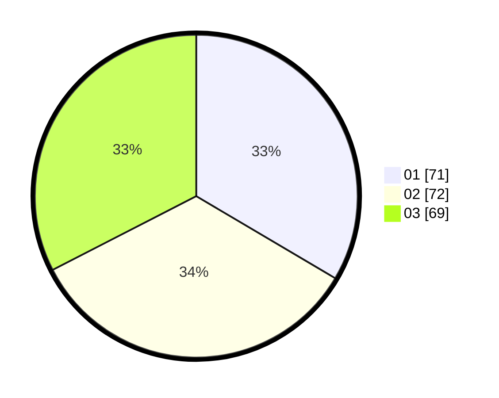

# Hasil

Hasil perolehan suara paslon dapat dilihat pada file paslon-01.txt, paslon-02.txt, dan paslon-03.txt.

Jika tidak ada, artinya data tersebut belum ada pada SIREKAP.

## Perolehan Suara

 * Paslon 01: **71**.
 * Paslon 02: **72**.
 * Paslon 03: **69**.

## Foto C Plano

https://sirekap-obj-formc.kpu.go.id/c639/pemilu/ppwp/31/75/02/10/03/3175021003094-20240214-155514--73d8f054-16c0-41c4-a9e3-ffe0fb607ada.jpg

https://sirekap-obj-formc.kpu.go.id/c639/pemilu/ppwp/31/75/02/10/03/3175021003094-20240214-155927--6c2f0232-1f88-40da-a73c-1500a5bf3d5d.jpg

https://sirekap-obj-formc.kpu.go.id/c639/pemilu/ppwp/31/75/02/10/03/3175021003094-20240214-160056--22456631-09b3-4260-ac1c-7e045b3da6b1.jpg
