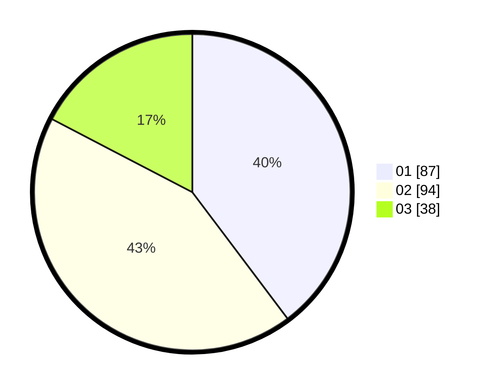

# Hasil

Hasil perolehan suara paslon dapat dilihat pada file paslon-01.txt, paslon-02.txt, dan paslon-03.txt.

Jika tidak ada, artinya data tersebut belum ada pada SIREKAP.

## Perolehan Suara

 * Paslon 01: **87**.
 * Paslon 02: **94**.
 * Paslon 03: **38**.

## Foto C Plano

https://sirekap-obj-formc.kpu.go.id/0dba/pemilu/ppwp/31/75/02/10/03/3175021003096-20240216-122030--6699b04f-b455-411b-8e78-de1a6ebcaea6.jpg

https://sirekap-obj-formc.kpu.go.id/0dba/pemilu/ppwp/31/75/02/10/03/3175021003096-20240216-122032--75becf4e-f2be-4f3a-a6a8-958bc1214c1a.jpg

https://sirekap-obj-formc.kpu.go.id/0dba/pemilu/ppwp/31/75/02/10/03/3175021003096-20240216-122031--e6268f4b-5315-454e-a414-0e0e9b6a88ea.jpg

## DATA PEMILIH TETAP

Jumlah pemilih dalam DPT: **283**.
 * L: **131**.
 * P: **152**.

## DATA PENGGUNA HAK PILIH

Jumlah pengguna hak pilih dalam DPT: **222**.
 * L: **100**.
 * P: **122**.

Jumlah pengguna hak pilih dalam DPTb: **0**.
 * L: **0**.
 * P: **0**.

Jumlah pengguna hak pilih dalam DPK: **0**.
 * L: **0**.
 * P: **0**.

Jumlah pengguna hak pilih: **222**.
 * L: **100**.
 * P: **122**.

## JUMLAH SUARA SAH DAN TIDAK SAH

JUMLAH SELURUH SUARA SAH: **219**.

JUMLAH SUARA TIDAK SAH: **3**.

JUMLAH SELURUH SUARA SAH DAN SUARA TIDAK SAH: **222**.
