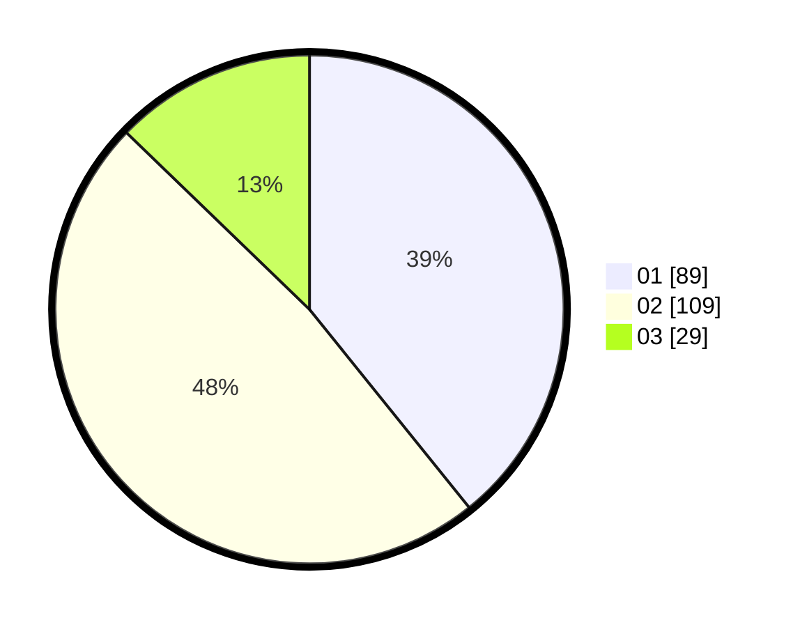

# Hasil

Hasil perolehan suara paslon dapat dilihat pada file paslon-01.txt, paslon-02.txt, dan paslon-03.txt.

Jika tidak ada, artinya data tersebut belum ada pada SIREKAP.

## Perolehan Suara

 * Paslon 01: **89**.
 * Paslon 02: **109**.
 * Paslon 03: **29**.

## Foto C Plano

https://sirekap-obj-formc.kpu.go.id/2601/pemilu/ppwp/31/75/02/10/03/3175021003100-20240215-021710--cd0b311b-2fea-4b3c-8073-d1267686b3cf.jpg

https://sirekap-obj-formc.kpu.go.id/2601/pemilu/ppwp/31/75/02/10/03/3175021003100-20240215-054402--f6ec9483-f5c4-4bce-84de-06b58619b89a.jpg

https://sirekap-obj-formc.kpu.go.id/2601/pemilu/ppwp/31/75/02/10/03/3175021003100-20240215-021127--35d08566-f6f1-40df-b655-0db265d5f07f.jpg
