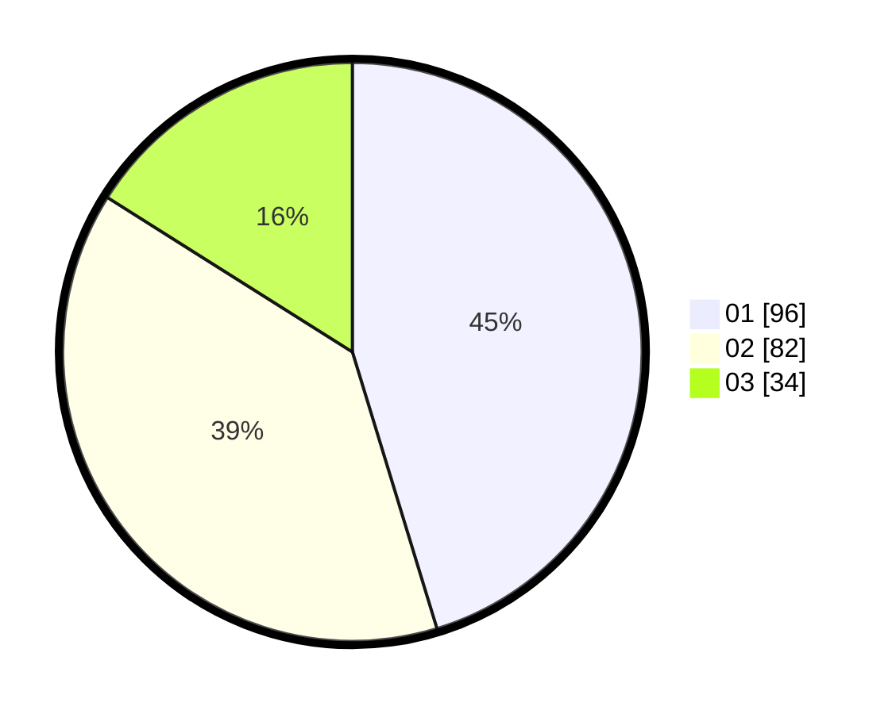

# Hasil

Hasil perolehan suara paslon dapat dilihat pada file paslon-01.txt, paslon-02.txt, dan paslon-03.txt.

Jika tidak ada, artinya data tersebut belum ada pada SIREKAP.

## Perolehan Suara

 * Paslon 01: **96**.
 * Paslon 02: **82**.
 * Paslon 03: **34**.

## Foto C Plano

https://sirekap-obj-formc.kpu.go.id/d1eb/pemilu/ppwp/31/75/02/10/03/3175021003102-20240216-004744--854246bb-85a4-4477-abd4-d05be32d3541.jpg

https://sirekap-obj-formc.kpu.go.id/d1eb/pemilu/ppwp/31/75/02/10/03/3175021003102-20240216-004746--07bef522-8bda-4bbb-bede-945bc2bd98d4.jpg

https://sirekap-obj-formc.kpu.go.id/d1eb/pemilu/ppwp/31/75/02/10/03/3175021003102-20240216-004745--a687e78f-cc56-466a-9768-fd93c4a60d0d.jpg

## DATA PEMILIH TETAP

Jumlah pemilih dalam DPT: **277**.
 * L: **140**.
 * P: **137**.

## DATA PENGGUNA HAK PILIH

Jumlah pengguna hak pilih dalam DPT: **207**.
 * L: **102**.
 * P: **105**.

Jumlah pengguna hak pilih dalam DPTb: **8**.
 * L: **5**.
 * P: **3**.

Jumlah pengguna hak pilih dalam DPK: **1**.
 * L: **1**.
 * P: **0**.

Jumlah pengguna hak pilih: **216**.
 * L: **108**.
 * P: **108**.

## JUMLAH SUARA SAH DAN TIDAK SAH

JUMLAH SELURUH SUARA SAH: **212**.

JUMLAH SUARA TIDAK SAH: **4**.

JUMLAH SELURUH SUARA SAH DAN SUARA TIDAK SAH: **216**.
