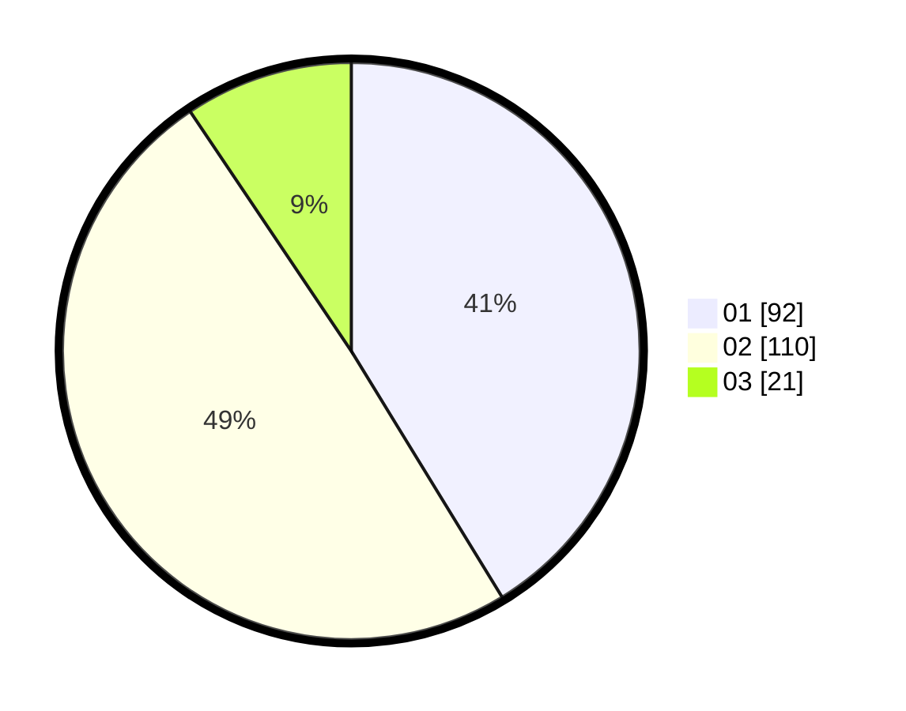

# Hasil

Hasil perolehan suara paslon dapat dilihat pada file paslon-01.txt, paslon-02.txt, dan paslon-03.txt.

Jika tidak ada, artinya data tersebut belum ada pada SIREKAP.

## Perolehan Suara

 * Paslon 01: **92**.
 * Paslon 02: **110**.
 * Paslon 03: **21**.

## Foto C Plano

https://sirekap-obj-formc.kpu.go.id/b256/pemilu/ppwp/31/75/02/10/03/3175021003105-20240215-034204--477ef9ee-d106-4188-ada1-8f146920fa06.jpg

https://sirekap-obj-formc.kpu.go.id/b256/pemilu/ppwp/31/75/02/10/03/3175021003105-20240215-034310--4d42e448-1c4e-4af6-afb9-db4d38dc4e9f.jpg

https://sirekap-obj-formc.kpu.go.id/b256/pemilu/ppwp/31/75/02/10/03/3175021003105-20240215-034422--3f9c140e-45fa-47b3-921a-3c1ec73bfce0.jpg
