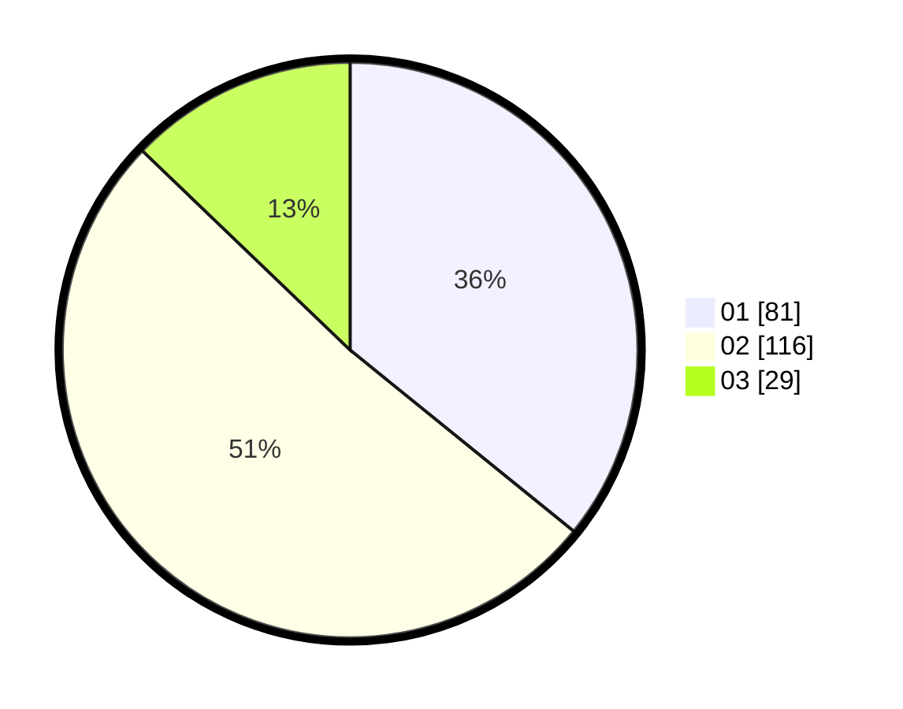

# Hasil

Hasil perolehan suara paslon dapat dilihat pada file paslon-01.txt, paslon-02.txt, dan paslon-03.txt.

Jika tidak ada, artinya data tersebut belum ada pada SIREKAP.

## Perolehan Suara

 * Paslon 01: **81**.
 * Paslon 02: **116**.
 * Paslon 03: **29**.

## Foto C Plano

https://sirekap-obj-formc.kpu.go.id/dbf6/pemilu/ppwp/31/75/02/10/03/3175021003108-20240215-023449--79735e32-4688-46eb-84d0-656366d894b1.jpg

https://sirekap-obj-formc.kpu.go.id/dbf6/pemilu/ppwp/31/75/02/10/03/3175021003108-20240215-010613--e57471da-b4e5-472b-9499-c70efc92b8d1.jpg

https://sirekap-obj-formc.kpu.go.id/dbf6/pemilu/ppwp/31/75/02/10/03/3175021003108-20240215-010416--c9b83572-c81b-442a-88ca-7471fe8c695a.jpg
