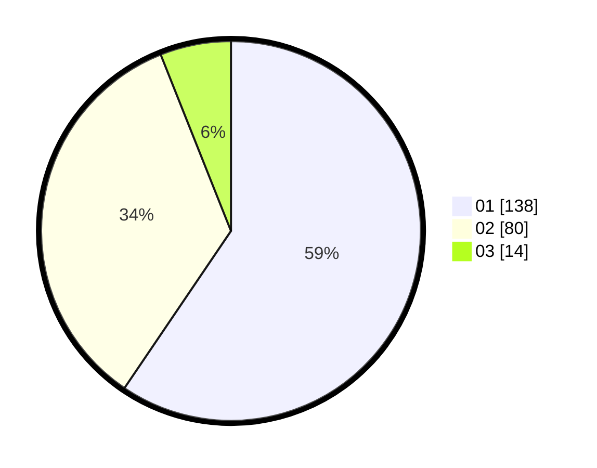

# Hasil

Hasil perolehan suara paslon dapat dilihat pada file paslon-01.txt, paslon-02.txt, dan paslon-03.txt.

Jika tidak ada, artinya data tersebut belum ada pada SIREKAP.

## Perolehan Suara

 * Paslon 01: **138**.
 * Paslon 02: **80**.
 * Paslon 03: **14**.

## Foto C Plano

https://sirekap-obj-formc.kpu.go.id/3f06/pemilu/ppwp/31/75/02/10/03/3175021003111-20240214-233445--988572c8-5a60-47b4-9775-32a454e76c25.jpg

https://sirekap-obj-formc.kpu.go.id/3f06/pemilu/ppwp/31/75/02/10/03/3175021003111-20240214-232852--d107fe40-6bb4-430f-9d89-a61b3bb9e254.jpg

https://sirekap-obj-formc.kpu.go.id/3f06/pemilu/ppwp/31/75/02/10/03/3175021003111-20240214-233242--4f971ed8-88e0-4d3f-a4c5-05b40f47688c.jpg

## DATA PEMILIH TETAP

Jumlah pemilih dalam DPT: **276**.
 * L: **132**.
 * P: **144**.

## DATA PENGGUNA HAK PILIH

Jumlah pengguna hak pilih dalam DPT: **232**.
 * L: **103**.
 * P: **129**.

Jumlah pengguna hak pilih dalam DPTb: **0**.
 * L: **0**.
 * P: **0**.

Jumlah pengguna hak pilih dalam DPK: **0**.
 * L: **0**.
 * P: **0**.

Jumlah pengguna hak pilih: **232**.
 * L: **103**.
 * P: **129**.

## JUMLAH SUARA SAH DAN TIDAK SAH

JUMLAH SELURUH SUARA SAH: **232**.

JUMLAH SUARA TIDAK SAH: **0**.

JUMLAH SELURUH SUARA SAH DAN SUARA TIDAK SAH: **232**.
