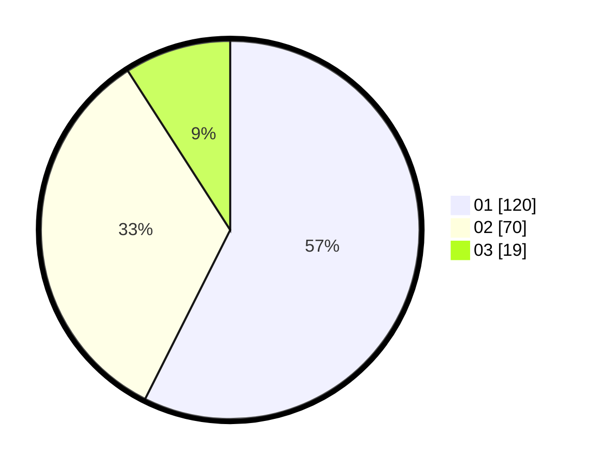

# Hasil

Hasil perolehan suara paslon dapat dilihat pada file paslon-01.txt, paslon-02.txt, dan paslon-03.txt.

Jika tidak ada, artinya data tersebut belum ada pada SIREKAP.

## Perolehan Suara

 * Paslon 01: **120**.
 * Paslon 02: **70**.
 * Paslon 03: **19**.

## Foto C Plano

https://sirekap-obj-formc.kpu.go.id/1422/pemilu/ppwp/31/75/02/10/03/3175021003113-20240214-155736--6664a654-e09e-486d-9d4a-a62180594e9e.jpg

https://sirekap-obj-formc.kpu.go.id/1422/pemilu/ppwp/31/75/02/10/03/3175021003113-20240214-155742--f8a84656-e5d7-4bdd-8530-d99d0d7d3fd9.jpg

https://sirekap-obj-formc.kpu.go.id/1422/pemilu/ppwp/31/75/02/10/03/3175021003113-20240214-193955--5c66e230-6105-4ca2-ab1f-83daa25d8ca8.jpg

## DATA PEMILIH TETAP

Jumlah pemilih dalam DPT: **271**.
 * L: **136**.
 * P: **135**.

## DATA PENGGUNA HAK PILIH

Jumlah pengguna hak pilih dalam DPT: **214**.
 * L: **107**.
 * P: **107**.

Jumlah pengguna hak pilih dalam DPTb: **0**.
 * L: **0**.
 * P: **0**.

Jumlah pengguna hak pilih dalam DPK: **2**.
 * L: **0**.
 * P: **2**.

Jumlah pengguna hak pilih: **216**.
 * L: **107**.
 * P: **109**.

## JUMLAH SUARA SAH DAN TIDAK SAH

JUMLAH SELURUH SUARA SAH: **209**.

JUMLAH SUARA TIDAK SAH: **7**.

JUMLAH SELURUH SUARA SAH DAN SUARA TIDAK SAH: **216**.
