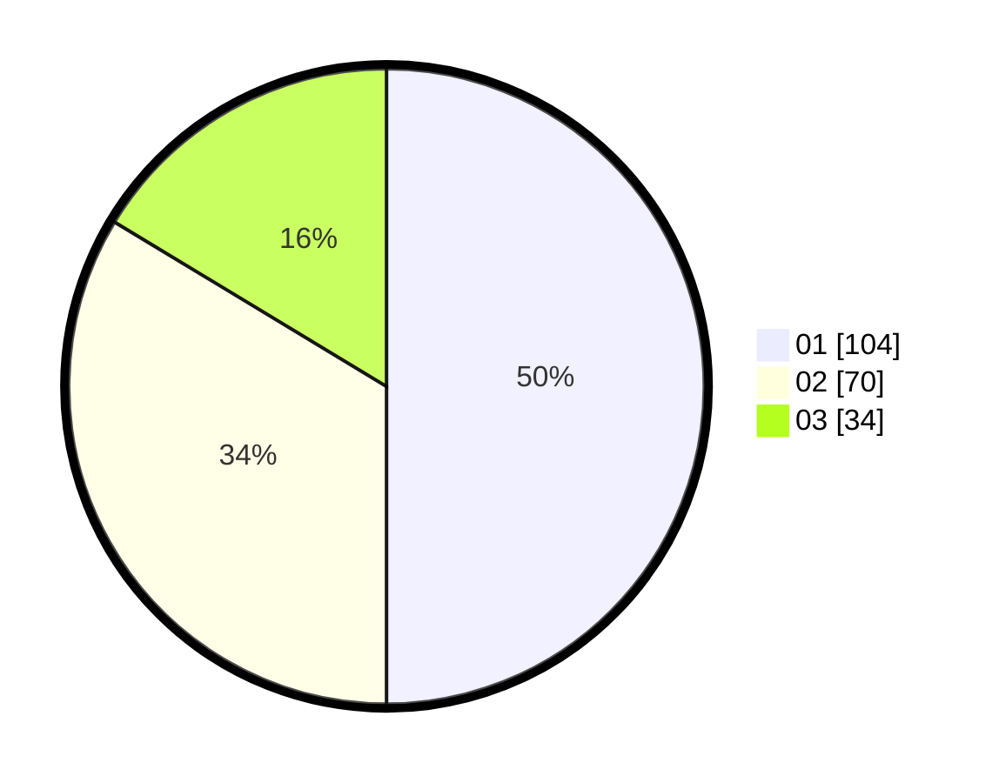

# Hasil

Hasil perolehan suara paslon dapat dilihat pada file paslon-01.txt, paslon-02.txt, dan paslon-03.txt.

Jika tidak ada, artinya data tersebut belum ada pada SIREKAP.

## Perolehan Suara

 * Paslon 01: **104**.
 * Paslon 02: **70**.
 * Paslon 03: **34**.

## Foto C Plano

https://sirekap-obj-formc.kpu.go.id/6930/pemilu/ppwp/31/75/02/10/03/3175021003117-20240214-155611--a47650a4-2e59-4be1-ac7e-c3a24dc85423.jpg

https://sirekap-obj-formc.kpu.go.id/6930/pemilu/ppwp/31/75/02/10/03/3175021003117-20240217-204153--773e0825-15a4-41c4-84ee-c00bb608dc1d.jpg

https://sirekap-obj-formc.kpu.go.id/6930/pemilu/ppwp/31/75/02/10/03/3175021003117-20240217-204152--a32f2e63-10a4-493a-9b77-d1e3a129a299.jpg

## DATA PEMILIH TETAP

Jumlah pemilih dalam DPT: **275**.
 * L: **138**.
 * P: **137**.

## DATA PENGGUNA HAK PILIH

Jumlah pengguna hak pilih dalam DPT: **212**.
 * L: **106**.
 * P: **106**.

Jumlah pengguna hak pilih dalam DPTb: **0**.
 * L: **0**.
 * P: **0**.

Jumlah pengguna hak pilih dalam DPK: **0**.
 * L: **0**.
 * P: **0**.

Jumlah pengguna hak pilih: **212**.
 * L: **106**.
 * P: **106**.

## JUMLAH SUARA SAH DAN TIDAK SAH

JUMLAH SELURUH SUARA SAH: **208**.

JUMLAH SUARA TIDAK SAH: **4**.

JUMLAH SELURUH SUARA SAH DAN SUARA TIDAK SAH: **212**.
