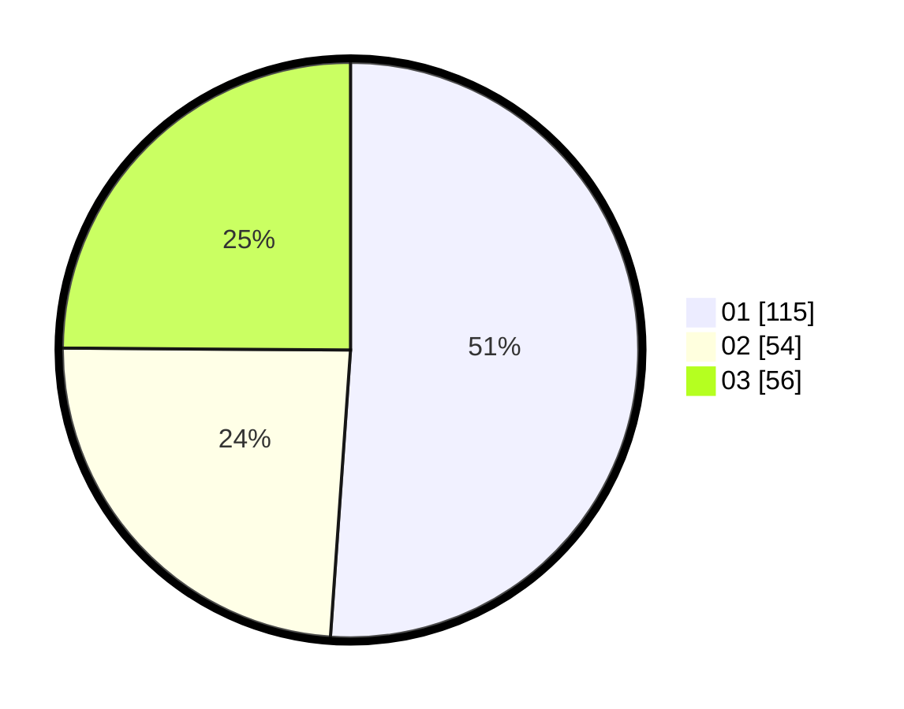

# Hasil

Hasil perolehan suara paslon dapat dilihat pada file paslon-01.txt, paslon-02.txt, dan paslon-03.txt.

Jika tidak ada, artinya data tersebut belum ada pada SIREKAP.

## Perolehan Suara

 * Paslon 01: **115**.
 * Paslon 02: **54**.
 * Paslon 03: **56**.

## Foto C Plano

https://sirekap-obj-formc.kpu.go.id/634b/pemilu/ppwp/31/75/02/10/03/3175021003119-20240215-003548--6542cf24-a1cf-4c8c-944c-3e1198a070df.jpg

https://sirekap-obj-formc.kpu.go.id/634b/pemilu/ppwp/31/75/02/10/03/3175021003119-20240215-003735--a154fa58-2bfa-4f6a-a0d1-956529bae231.jpg

https://sirekap-obj-formc.kpu.go.id/634b/pemilu/ppwp/31/75/02/10/03/3175021003119-20240215-081036--6558298a-96de-40e3-89ff-359949f99194.jpg

## DATA PEMILIH TETAP

Jumlah pemilih dalam DPT: **274**.
 * L: **131**.
 * P: **143**.

## DATA PENGGUNA HAK PILIH

Jumlah pengguna hak pilih dalam DPT: **223**.
 * L: **104**.
 * P: **119**.

Jumlah pengguna hak pilih dalam DPTb: **3**.
 * L: **1**.
 * P: **2**.

Jumlah pengguna hak pilih dalam DPK: **1**.
 * L: **0**.
 * P: **1**.

Jumlah pengguna hak pilih: **227**.
 * L: **105**.
 * P: **122**.

## JUMLAH SUARA SAH DAN TIDAK SAH

JUMLAH SELURUH SUARA SAH: **225**.

JUMLAH SUARA TIDAK SAH: **2**.

JUMLAH SELURUH SUARA SAH DAN SUARA TIDAK SAH: **227**.
