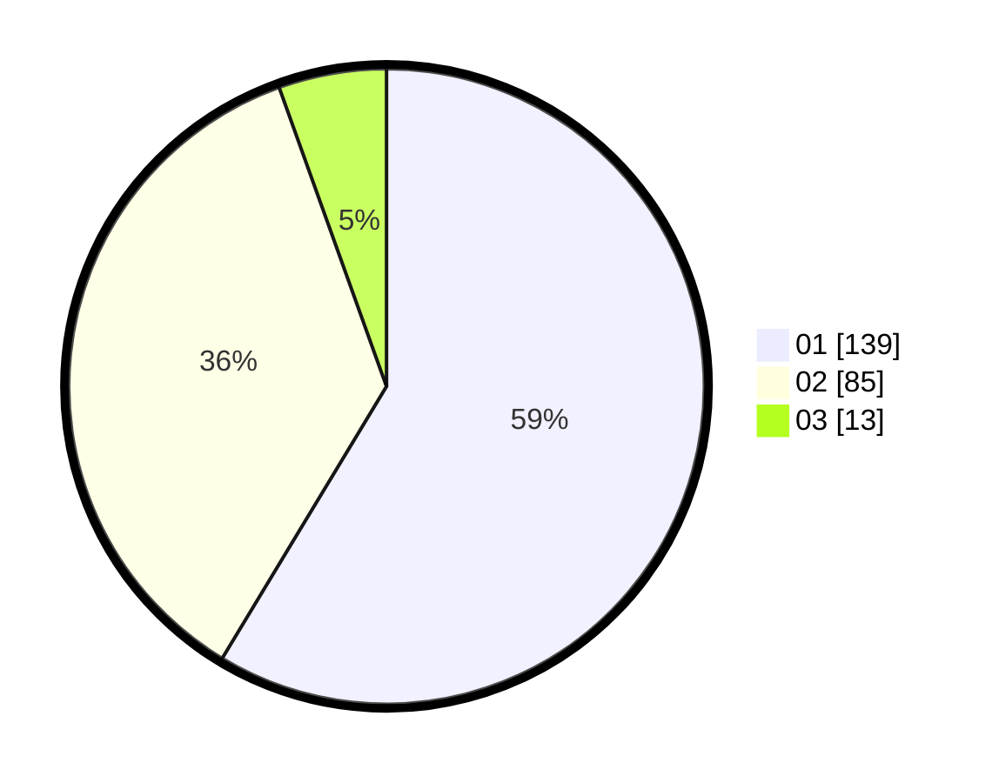

# Hasil

Hasil perolehan suara paslon dapat dilihat pada file paslon-01.txt, paslon-02.txt, dan paslon-03.txt.

Jika tidak ada, artinya data tersebut belum ada pada SIREKAP.

## Perolehan Suara

 * Paslon 01: **139**.
 * Paslon 02: **85**.
 * Paslon 03: **13**.

## Foto C Plano

https://sirekap-obj-formc.kpu.go.id/4587/pemilu/ppwp/31/75/02/10/04/3175021004002-20240214-155025--bd0716c3-44cd-4e38-9816-61b5a42f06e4.jpg

https://sirekap-obj-formc.kpu.go.id/4587/pemilu/ppwp/31/75/02/10/04/3175021004002-20240214-155113--eb3338f1-8eb2-4e5f-8be4-c86ec0923bd5.jpg

https://sirekap-obj-formc.kpu.go.id/4587/pemilu/ppwp/31/75/02/10/04/3175021004002-20240214-155138--b2f359a2-0531-429a-8259-a84516cd6f20.jpg

## DATA PEMILIH TETAP

Jumlah pemilih dalam DPT: **282**.
 * L: **135**.
 * P: **147**.

## DATA PENGGUNA HAK PILIH

Jumlah pengguna hak pilih dalam DPT: **241**.
 * L: **115**.
 * P: **126**.

Jumlah pengguna hak pilih dalam DPTb: **0**.
 * L: **0**.
 * P: **0**.

Jumlah pengguna hak pilih dalam DPK: **3**.
 * L: **1**.
 * P: **2**.

Jumlah pengguna hak pilih: **244**.
 * L: **116**.
 * P: **128**.

## JUMLAH SUARA SAH DAN TIDAK SAH

JUMLAH SELURUH SUARA SAH: **237**.

JUMLAH SUARA TIDAK SAH: **7**.

JUMLAH SELURUH SUARA SAH DAN SUARA TIDAK SAH: **244**.
