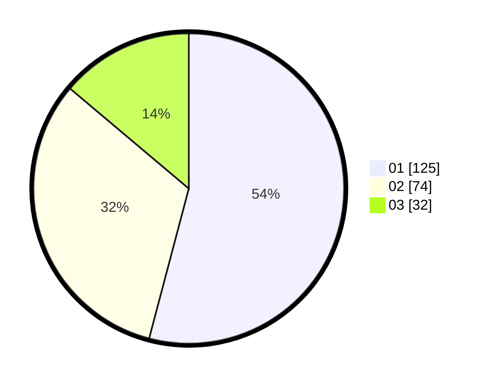

# Hasil

Hasil perolehan suara paslon dapat dilihat pada file paslon-01.txt, paslon-02.txt, dan paslon-03.txt.

Jika tidak ada, artinya data tersebut belum ada pada SIREKAP.

## Perolehan Suara

 * Paslon 01: **125**.
 * Paslon 02: **74**.
 * Paslon 03: **32**.

## Foto C Plano

https://sirekap-obj-formc.kpu.go.id/df17/pemilu/ppwp/31/75/02/10/04/3175021004006-20240216-012929--6a028c9c-33ce-489e-9144-6f4063e9b7be.jpg

https://sirekap-obj-formc.kpu.go.id/df17/pemilu/ppwp/31/75/02/10/04/3175021004006-20240216-012943--1ab92962-51f2-425d-bb32-ce4578e2ee24.jpg

https://sirekap-obj-formc.kpu.go.id/df17/pemilu/ppwp/31/75/02/10/04/3175021004006-20240216-012936--79dd87c4-bff4-48e9-9877-65a9159a3f6a.jpg

## DATA PEMILIH TETAP

Jumlah pemilih dalam DPT: **280**.
 * L: **136**.
 * P: **144**.

## DATA PENGGUNA HAK PILIH

Jumlah pengguna hak pilih dalam DPT: **233**.
 * L: **107**.
 * P: **126**.

Jumlah pengguna hak pilih dalam DPTb: **0**.
 * L: **0**.
 * P: **0**.

Jumlah pengguna hak pilih dalam DPK: **0**.
 * L: **0**.
 * P: **0**.

Jumlah pengguna hak pilih: **233**.
 * L: **107**.
 * P: **126**.

## JUMLAH SUARA SAH DAN TIDAK SAH

JUMLAH SELURUH SUARA SAH: **231**.

JUMLAH SUARA TIDAK SAH: **2**.

JUMLAH SELURUH SUARA SAH DAN SUARA TIDAK SAH: **233**.
