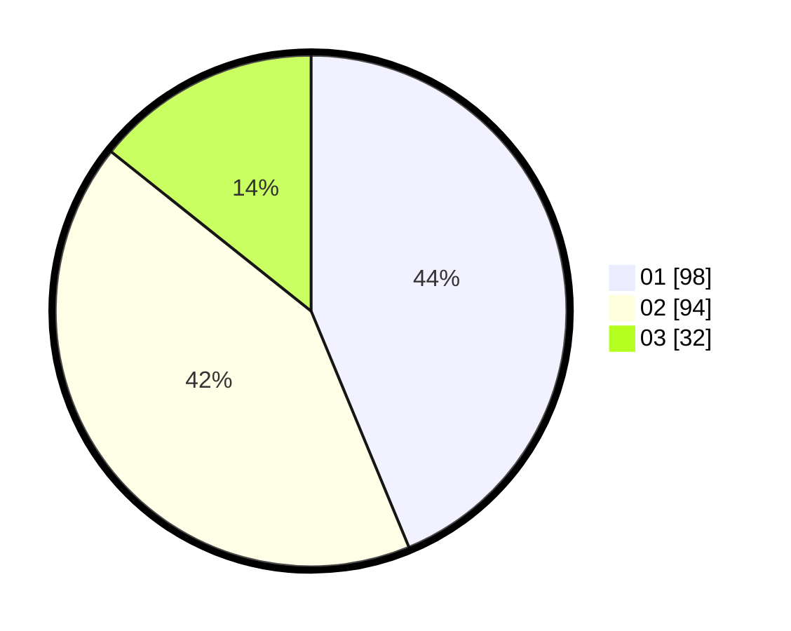

# Hasil

Hasil perolehan suara paslon dapat dilihat pada file paslon-01.txt, paslon-02.txt, dan paslon-03.txt.

Jika tidak ada, artinya data tersebut belum ada pada SIREKAP.

## Perolehan Suara

 * Paslon 01: **98**.
 * Paslon 02: **94**.
 * Paslon 03: **32**.

## Foto C Plano

https://sirekap-obj-formc.kpu.go.id/b03e/pemilu/ppwp/31/75/02/10/04/3175021004008-20240214-225711--72650e32-f7c7-4304-9388-ed8dae854d3d.jpg

https://sirekap-obj-formc.kpu.go.id/b03e/pemilu/ppwp/31/75/02/10/04/3175021004008-20240214-225817--9709c1db-f7e9-4573-b376-b4b9fc873b95.jpg

https://sirekap-obj-formc.kpu.go.id/b03e/pemilu/ppwp/31/75/02/10/04/3175021004008-20240214-225927--df7a0efb-c1de-47d1-b632-8f75ecbbcd24.jpg
