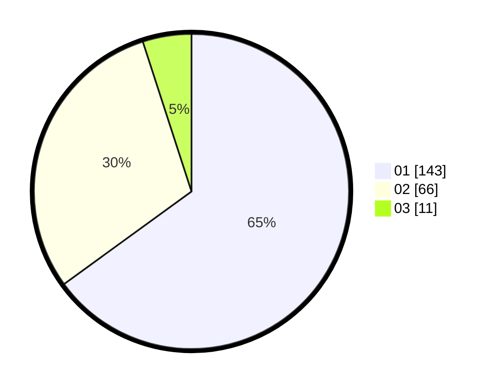

# Hasil

Hasil perolehan suara paslon dapat dilihat pada file paslon-01.txt, paslon-02.txt, dan paslon-03.txt.

Jika tidak ada, artinya data tersebut belum ada pada SIREKAP.

## Perolehan Suara

 * Paslon 01: **143**.
 * Paslon 02: **66**.
 * Paslon 03: **11**.

## Foto C Plano

https://sirekap-obj-formc.kpu.go.id/16f2/pemilu/ppwp/31/75/02/10/04/3175021004010-20240214-155100--5a348902-252f-4636-90ef-83521416536d.jpg

https://sirekap-obj-formc.kpu.go.id/16f2/pemilu/ppwp/31/75/02/10/04/3175021004010-20240216-105510--b8a5276a-9088-47a1-88e9-b4fd586bace6.jpg

https://sirekap-obj-formc.kpu.go.id/16f2/pemilu/ppwp/31/75/02/10/04/3175021004010-20240216-105509--a7f35922-c93f-4cf9-b81b-0368d735e28c.jpg

## DATA PEMILIH TETAP

Jumlah pemilih dalam DPT: **277**.
 * L: **147**.
 * P: **175**.

## DATA PENGGUNA HAK PILIH

Jumlah pengguna hak pilih dalam DPT: **221**.
 * L: **108**.
 * P: **113**.

Jumlah pengguna hak pilih dalam DPTb: **0**.
 * L: **0**.
 * P: **0**.

Jumlah pengguna hak pilih dalam DPK: **0**.
 * L: **0**.
 * P: **0**.

Jumlah pengguna hak pilih: **221**.
 * L: **108**.
 * P: **113**.

## JUMLAH SUARA SAH DAN TIDAK SAH

JUMLAH SELURUH SUARA SAH: **220**.

JUMLAH SUARA TIDAK SAH: **1**.

JUMLAH SELURUH SUARA SAH DAN SUARA TIDAK SAH: **221**.
