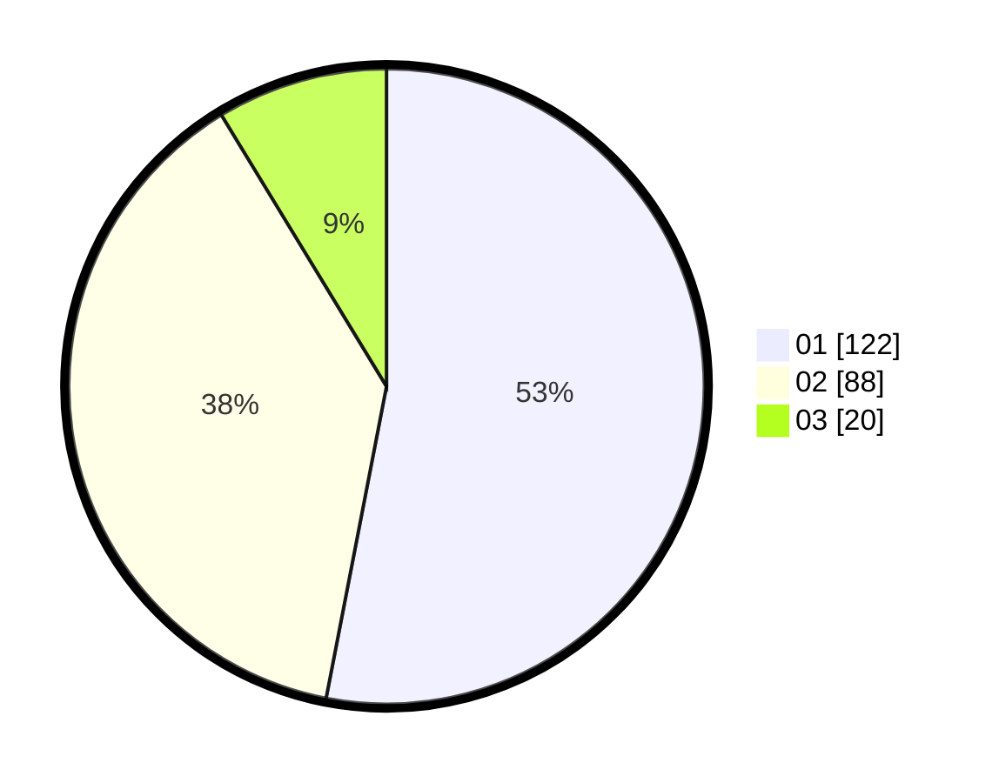

# Hasil

Hasil perolehan suara paslon dapat dilihat pada file paslon-01.txt, paslon-02.txt, dan paslon-03.txt.

Jika tidak ada, artinya data tersebut belum ada pada SIREKAP.

## Perolehan Suara

 * Paslon 01: **122**.
 * Paslon 02: **88**.
 * Paslon 03: **20**.

## Foto C Plano

https://sirekap-obj-formc.kpu.go.id/2795/pemilu/ppwp/31/75/02/10/04/3175021004012-20240216-070446--515679b1-4f93-43e7-adf3-38fed18c7e37.jpg

https://sirekap-obj-formc.kpu.go.id/2795/pemilu/ppwp/31/75/02/10/04/3175021004012-20240214-185540--e1d83ce3-ccc8-4f3f-9744-973377c120ed.jpg

https://sirekap-obj-formc.kpu.go.id/2795/pemilu/ppwp/31/75/02/10/04/3175021004012-20240216-073744--306ee263-7d42-445c-a6b3-443cf4b553e5.jpg

## DATA PEMILIH TETAP

Jumlah pemilih dalam DPT: **277**.
 * L: **133**.
 * P: **144**.

## DATA PENGGUNA HAK PILIH

Jumlah pengguna hak pilih dalam DPT: **224**.
 * L: **104**.
 * P: **120**.

Jumlah pengguna hak pilih dalam DPTb: **2**.
 * L: **1**.
 * P: **1**.

Jumlah pengguna hak pilih dalam DPK: **6**.
 * L: **5**.
 * P: **1**.

Jumlah pengguna hak pilih: **232**.
 * L: **110**.
 * P: **122**.

## JUMLAH SUARA SAH DAN TIDAK SAH

JUMLAH SELURUH SUARA SAH: **230**.

JUMLAH SUARA TIDAK SAH: **2**.

JUMLAH SELURUH SUARA SAH DAN SUARA TIDAK SAH: **232**.
