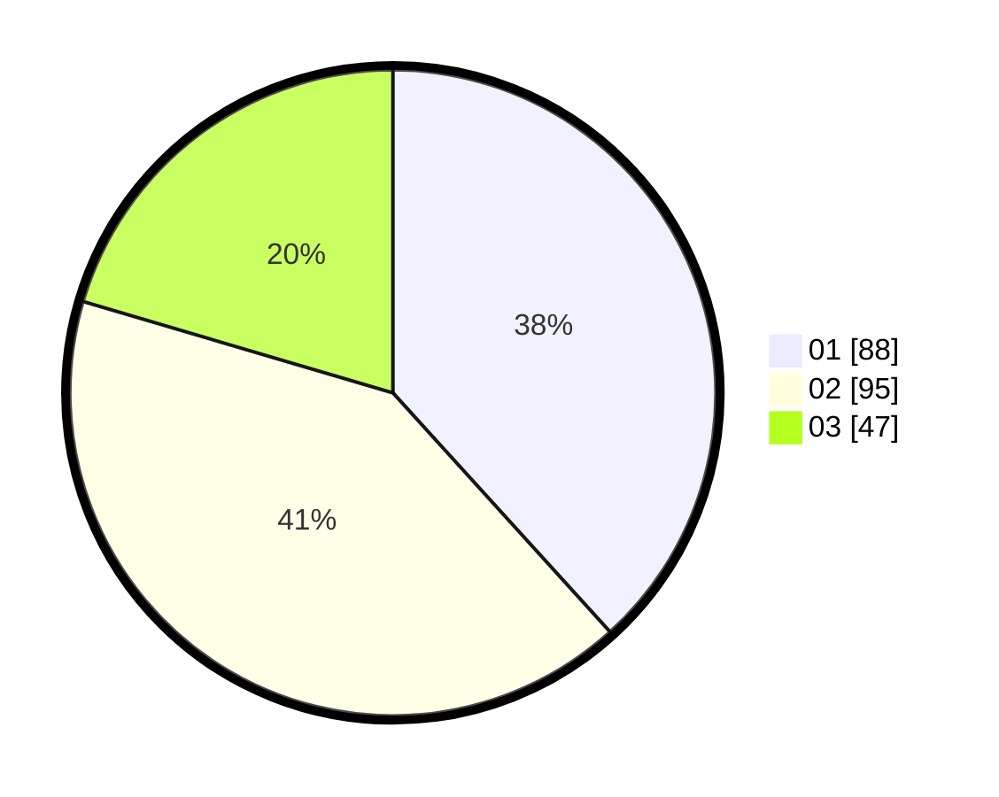

# Hasil

Hasil perolehan suara paslon dapat dilihat pada file paslon-01.txt, paslon-02.txt, dan paslon-03.txt.

Jika tidak ada, artinya data tersebut belum ada pada SIREKAP.

## Perolehan Suara

 * Paslon 01: **88**.
 * Paslon 02: **95**.
 * Paslon 03: **47**.

## Foto C Plano

https://sirekap-obj-formc.kpu.go.id/e502/pemilu/ppwp/31/75/02/10/04/3175021004015-20240216-064003--ccf090df-6f90-4538-a79c-e93e13624655.jpg

https://sirekap-obj-formc.kpu.go.id/e502/pemilu/ppwp/31/75/02/10/04/3175021004015-20240216-064008--3100316f-b33a-4449-9ca1-a260c1a1bd9c.jpg

https://sirekap-obj-formc.kpu.go.id/e502/pemilu/ppwp/31/75/02/10/04/3175021004015-20240216-064007--103951a1-097c-4112-a290-73a173541c99.jpg

## DATA PEMILIH TETAP

Jumlah pemilih dalam DPT: **275**.
 * L: **133**.
 * P: **142**.

## DATA PENGGUNA HAK PILIH

Jumlah pengguna hak pilih dalam DPT: **229**.
 * L: **106**.
 * P: **123**.

Jumlah pengguna hak pilih dalam DPTb: **1**.
 * L: **0**.
 * P: **1**.

Jumlah pengguna hak pilih dalam DPK: **0**.
 * L: **0**.
 * P: **0**.

Jumlah pengguna hak pilih: **230**.
 * L: **106**.
 * P: **124**.

## JUMLAH SUARA SAH DAN TIDAK SAH

JUMLAH SELURUH SUARA SAH: **230**.

JUMLAH SUARA TIDAK SAH: **0**.

JUMLAH SELURUH SUARA SAH DAN SUARA TIDAK SAH: **230**.
