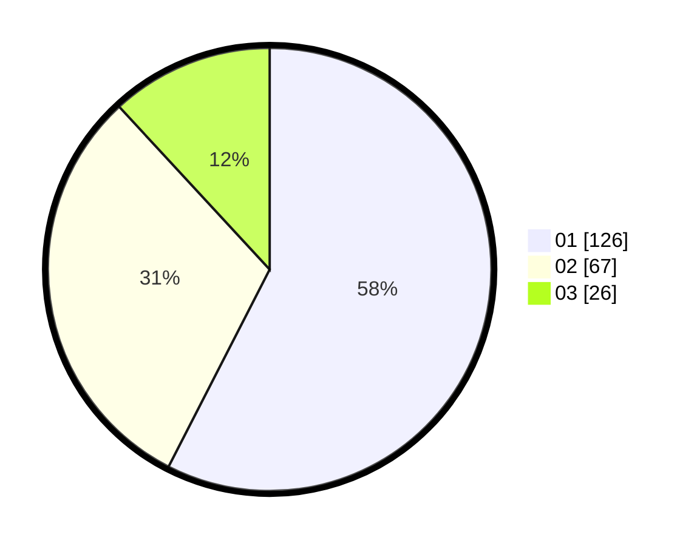

# Hasil

Hasil perolehan suara paslon dapat dilihat pada file paslon-01.txt, paslon-02.txt, dan paslon-03.txt.

Jika tidak ada, artinya data tersebut belum ada pada SIREKAP.

## Perolehan Suara

 * Paslon 01: **126**.
 * Paslon 02: **67**.
 * Paslon 03: **26**.

## Foto C Plano

https://sirekap-obj-formc.kpu.go.id/dfa8/pemilu/ppwp/31/75/02/10/04/3175021004017-20240214-194505--45d2305b-3796-4691-b545-075dcf9010e6.jpg

https://sirekap-obj-formc.kpu.go.id/dfa8/pemilu/ppwp/31/75/02/10/04/3175021004017-20240214-194053--b4a0c4b2-489c-47a7-8fc5-72200b87d1e1.jpg

https://sirekap-obj-formc.kpu.go.id/dfa8/pemilu/ppwp/31/75/02/10/04/3175021004017-20240214-194227--f870f145-9c4f-40a3-a192-7923385d55c6.jpg

## DATA PEMILIH TETAP

Jumlah pemilih dalam DPT: **275**.
 * L: **134**.
 * P: **141**.

## DATA PENGGUNA HAK PILIH

Jumlah pengguna hak pilih dalam DPT: **222**.
 * L: **104**.
 * P: **118**.

Jumlah pengguna hak pilih dalam DPTb: **0**.
 * L: **0**.
 * P: **0**.

Jumlah pengguna hak pilih dalam DPK: **1**.
 * L: **1**.
 * P: **0**.

Jumlah pengguna hak pilih: **223**.
 * L: **105**.
 * P: **118**.

## JUMLAH SUARA SAH DAN TIDAK SAH

JUMLAH SELURUH SUARA SAH: **219**.

JUMLAH SUARA TIDAK SAH: **4**.

JUMLAH SELURUH SUARA SAH DAN SUARA TIDAK SAH: **223**.
