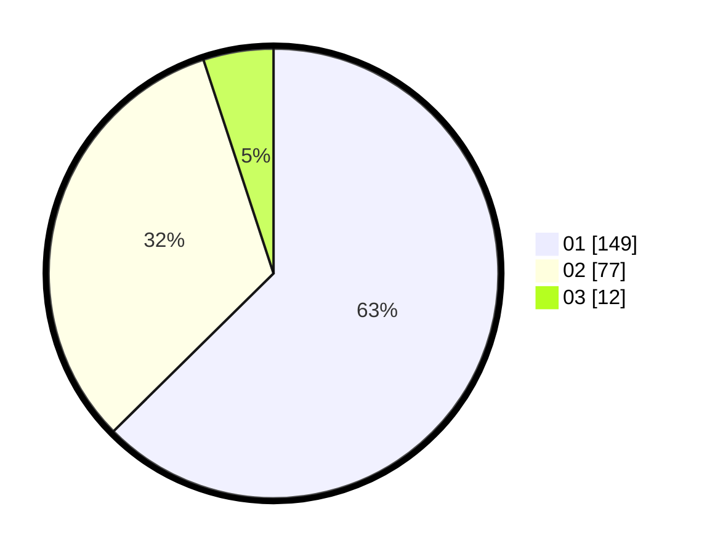

# Hasil

Hasil perolehan suara paslon dapat dilihat pada file paslon-01.txt, paslon-02.txt, dan paslon-03.txt.

Jika tidak ada, artinya data tersebut belum ada pada SIREKAP.

## Perolehan Suara

 * Paslon 01: **149**.
 * Paslon 02: **77**.
 * Paslon 03: **12**.

## Foto C Plano

https://sirekap-obj-formc.kpu.go.id/71b9/pemilu/ppwp/31/75/02/10/04/3175021004018-20240216-055323--6c1f3236-d89c-41f4-8246-24b394d140f6.jpg

https://sirekap-obj-formc.kpu.go.id/71b9/pemilu/ppwp/31/75/02/10/04/3175021004018-20240216-053415--dc5ffc02-baeb-4821-8c33-f6db770a36df.jpg

https://sirekap-obj-formc.kpu.go.id/71b9/pemilu/ppwp/31/75/02/10/04/3175021004018-20240216-053411--29b3f985-0d11-4f15-ae41-e8f8c6f5c873.jpg

## DATA PEMILIH TETAP

Jumlah pemilih dalam DPT: **291**.
 * L: **147**.
 * P: **144**.

## DATA PENGGUNA HAK PILIH

Jumlah pengguna hak pilih dalam DPT: **238**.
 * L: **117**.
 * P: **121**.

Jumlah pengguna hak pilih dalam DPTb: **2**.
 * L: **1**.
 * P: **1**.

Jumlah pengguna hak pilih dalam DPK: **2**.
 * L: **0**.
 * P: **2**.

Jumlah pengguna hak pilih: **242**.
 * L: **118**.
 * P: **124**.

## JUMLAH SUARA SAH DAN TIDAK SAH

JUMLAH SELURUH SUARA SAH: **238**.

JUMLAH SUARA TIDAK SAH: **4**.

JUMLAH SELURUH SUARA SAH DAN SUARA TIDAK SAH: **242**.
