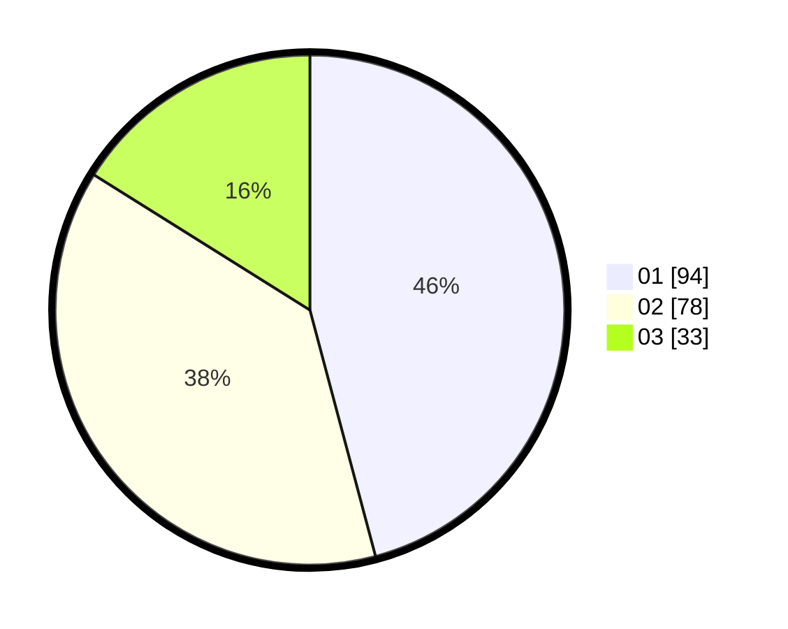

# Hasil

Hasil perolehan suara paslon dapat dilihat pada file paslon-01.txt, paslon-02.txt, dan paslon-03.txt.

Jika tidak ada, artinya data tersebut belum ada pada SIREKAP.

## Perolehan Suara

 * Paslon 01: **94**.
 * Paslon 02: **78**.
 * Paslon 03: **33**.

## Foto C Plano

https://sirekap-obj-formc.kpu.go.id/6ba7/pemilu/ppwp/31/75/02/10/04/3175021004029-20240216-042548--6fd9b873-91b9-4c20-b74d-d8429125f2e8.jpg

https://sirekap-obj-formc.kpu.go.id/6ba7/pemilu/ppwp/31/75/02/10/04/3175021004029-20240216-042551--f0a4af6b-e6d1-4698-b18d-9fae3bbee57f.jpg

https://sirekap-obj-formc.kpu.go.id/6ba7/pemilu/ppwp/31/75/02/10/04/3175021004029-20240216-042549--9e226d34-7f17-46d9-8fc3-c13f60d89e6a.jpg

## DATA PEMILIH TETAP

Jumlah pemilih dalam DPT: **280**.
 * L: **135**.
 * P: **145**.

## DATA PENGGUNA HAK PILIH

Jumlah pengguna hak pilih dalam DPT: **208**.
 * L: **98**.
 * P: **110**.

Jumlah pengguna hak pilih dalam DPTb: **0**.
 * L: **0**.
 * P: **0**.

Jumlah pengguna hak pilih dalam DPK: **1**.
 * L: **0**.
 * P: **1**.

Jumlah pengguna hak pilih: **209**.
 * L: **98**.
 * P: **111**.

## JUMLAH SUARA SAH DAN TIDAK SAH

JUMLAH SELURUH SUARA SAH: **205**.

JUMLAH SUARA TIDAK SAH: **4**.

JUMLAH SELURUH SUARA SAH DAN SUARA TIDAK SAH: **209**.
