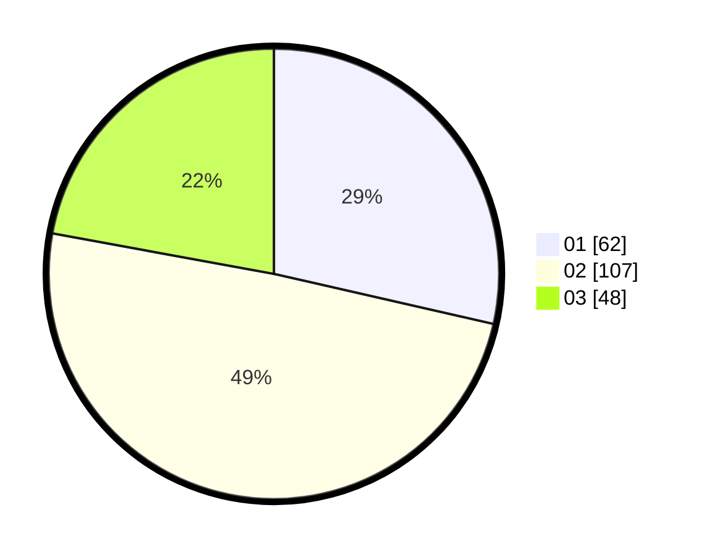

# Hasil

Hasil perolehan suara paslon dapat dilihat pada file paslon-01.txt, paslon-02.txt, dan paslon-03.txt.

Jika tidak ada, artinya data tersebut belum ada pada SIREKAP.

## Perolehan Suara

 * Paslon 01: **62**.
 * Paslon 02: **107**.
 * Paslon 03: **48**.

## Foto C Plano

https://sirekap-obj-formc.kpu.go.id/b24f/pemilu/ppwp/31/75/02/10/04/3175021004030-20240216-135848--d7153290-1864-4512-a1ed-2cf5c8bdf331.jpg

https://sirekap-obj-formc.kpu.go.id/b24f/pemilu/ppwp/31/75/02/10/04/3175021004030-20240216-132547--c2b0b20e-79b3-4542-b748-c8afa06b5ec5.jpg

https://sirekap-obj-formc.kpu.go.id/b24f/pemilu/ppwp/31/75/02/10/04/3175021004030-20240216-135848--457a952c-e316-4315-bbaa-984c78e1b784.jpg

## DATA PEMILIH TETAP

Jumlah pemilih dalam DPT: **286**.
 * L: **145**.
 * P: **141**.

## DATA PENGGUNA HAK PILIH

Jumlah pengguna hak pilih dalam DPT: **215**.
 * L: **104**.
 * P: **111**.

Jumlah pengguna hak pilih dalam DPTb: **3**.
 * L: **2**.
 * P: **1**.

Jumlah pengguna hak pilih dalam DPK: **2**.
 * L: **1**.
 * P: **1**.

Jumlah pengguna hak pilih: **220**.
 * L: **107**.
 * P: **113**.

## JUMLAH SUARA SAH DAN TIDAK SAH

JUMLAH SELURUH SUARA SAH: **217**.

JUMLAH SUARA TIDAK SAH: **3**.

JUMLAH SELURUH SUARA SAH DAN SUARA TIDAK SAH: **220**.
