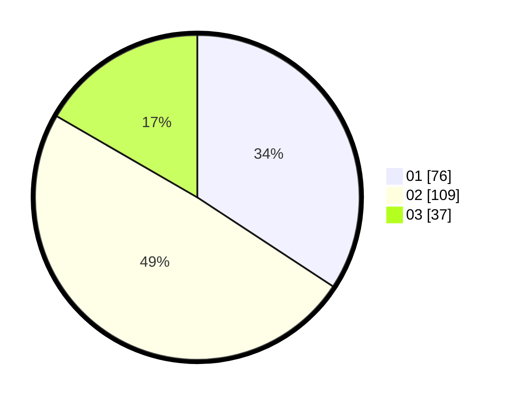

# Hasil

Hasil perolehan suara paslon dapat dilihat pada file paslon-01.txt, paslon-02.txt, dan paslon-03.txt.

Jika tidak ada, artinya data tersebut belum ada pada SIREKAP.

## Perolehan Suara

 * Paslon 01: **76**.
 * Paslon 02: **109**.
 * Paslon 03: **37**.

## Foto C Plano

https://sirekap-obj-formc.kpu.go.id/55ca/pemilu/ppwp/31/75/02/10/04/3175021004031-20240216-131809--58fa554c-e103-43d4-9c58-0a6bf3fdc98a.jpg

https://sirekap-obj-formc.kpu.go.id/55ca/pemilu/ppwp/31/75/02/10/04/3175021004031-20240214-155158--3b8d8725-28d7-4d52-b846-30b6e4123018.jpg

https://sirekap-obj-formc.kpu.go.id/55ca/pemilu/ppwp/31/75/02/10/04/3175021004031-20240214-193844--9c4f47f1-d5b0-4ce1-8a11-ebb144a9ceb9.jpg

## DATA PEMILIH TETAP

Jumlah pemilih dalam DPT: **280**.
 * L: **136**.
 * P: **144**.

## DATA PENGGUNA HAK PILIH

Jumlah pengguna hak pilih dalam DPT: **223**.
 * L: **108**.
 * P: **115**.

Jumlah pengguna hak pilih dalam DPTb: **0**.
 * L: **0**.
 * P: **0**.

Jumlah pengguna hak pilih dalam DPK: **2**.
 * L: **1**.
 * P: **1**.

Jumlah pengguna hak pilih: **225**.
 * L: **109**.
 * P: **116**.

## JUMLAH SUARA SAH DAN TIDAK SAH

JUMLAH SELURUH SUARA SAH: **222**.

JUMLAH SUARA TIDAK SAH: **3**.

JUMLAH SELURUH SUARA SAH DAN SUARA TIDAK SAH: **225**.
