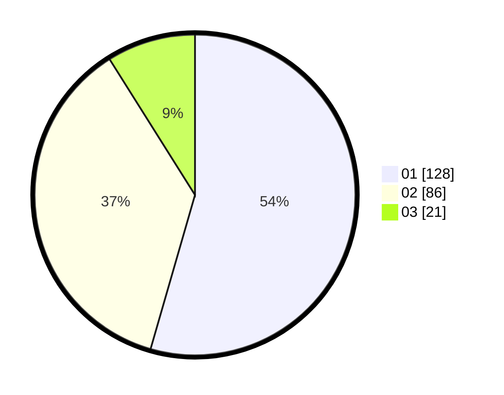

# Hasil

Hasil perolehan suara paslon dapat dilihat pada file paslon-01.txt, paslon-02.txt, dan paslon-03.txt.

Jika tidak ada, artinya data tersebut belum ada pada SIREKAP.

## Perolehan Suara

 * Paslon 01: **128**.
 * Paslon 02: **86**.
 * Paslon 03: **21**.

## Foto C Plano

https://sirekap-obj-formc.kpu.go.id/e134/pemilu/ppwp/31/75/02/10/04/3175021004032-20240216-154844--1b5e3a9b-7f58-45b3-9d0d-c8a2373e9587.jpg

https://sirekap-obj-formc.kpu.go.id/e134/pemilu/ppwp/31/75/02/10/04/3175021004032-20240216-154846--1a0df8e6-a887-416b-b864-dfd447b36f0a.jpg

https://sirekap-obj-formc.kpu.go.id/e134/pemilu/ppwp/31/75/02/10/04/3175021004032-20240216-154845--03a901f2-d7e9-4394-b8d8-3e37f4d1ee12.jpg

## DATA PEMILIH TETAP

Jumlah pemilih dalam DPT: **279**.
 * L: **143**.
 * P: **136**.

## DATA PENGGUNA HAK PILIH

Jumlah pengguna hak pilih dalam DPT: **242**.
 * L: **124**.
 * P: **118**.

Jumlah pengguna hak pilih dalam DPTb: **0**.
 * L: **0**.
 * P: **0**.

Jumlah pengguna hak pilih dalam DPK: **0**.
 * L: **1**.
 * P: **0**.

Jumlah pengguna hak pilih: **243**.
 * L: **125**.
 * P: **118**.

## JUMLAH SUARA SAH DAN TIDAK SAH

JUMLAH SELURUH SUARA SAH: **235**.

JUMLAH SUARA TIDAK SAH: **8**.

JUMLAH SELURUH SUARA SAH DAN SUARA TIDAK SAH: **243**.
