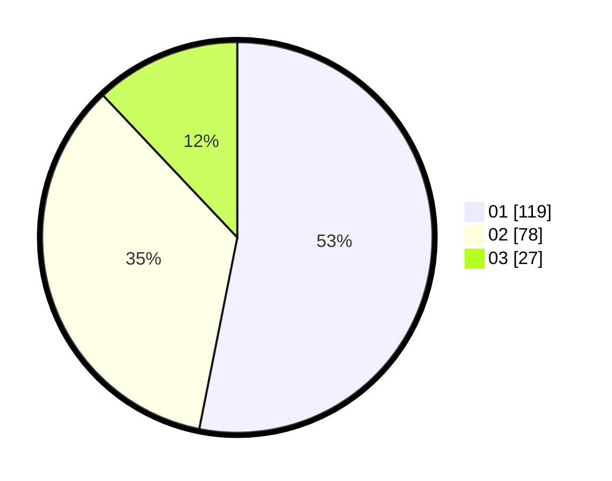

# Hasil

Hasil perolehan suara paslon dapat dilihat pada file paslon-01.txt, paslon-02.txt, dan paslon-03.txt.

Jika tidak ada, artinya data tersebut belum ada pada SIREKAP.

## Perolehan Suara

 * Paslon 01: **119**.
 * Paslon 02: **78**.
 * Paslon 03: **27**.

## Foto C Plano

https://sirekap-obj-formc.kpu.go.id/2373/pemilu/ppwp/31/75/02/10/04/3175021004034-20240214-220151--57b2e54d-1d08-4aff-bbdd-e24a6c1dcc1d.jpg

https://sirekap-obj-formc.kpu.go.id/2373/pemilu/ppwp/31/75/02/10/04/3175021004034-20240214-220255--5c3aed66-0820-4c7f-a55f-45cf1f3fba24.jpg

https://sirekap-obj-formc.kpu.go.id/2373/pemilu/ppwp/31/75/02/10/04/3175021004034-20240215-173330--9320fb5f-93d7-4249-935a-f1e8bb172316.jpg

## DATA PEMILIH TETAP

Jumlah pemilih dalam DPT: **279**.
 * L: **128**.
 * P: **151**.

## DATA PENGGUNA HAK PILIH

Jumlah pengguna hak pilih dalam DPT: **228**.
 * L: **99**.
 * P: **129**.

Jumlah pengguna hak pilih dalam DPTb: **4**.
 * L: **1**.
 * P: **3**.

Jumlah pengguna hak pilih dalam DPK: **0**.
 * L: **0**.
 * P: **0**.

Jumlah pengguna hak pilih: **232**.
 * L: **100**.
 * P: **132**.

## JUMLAH SUARA SAH DAN TIDAK SAH

JUMLAH SELURUH SUARA SAH: **224**.

JUMLAH SUARA TIDAK SAH: **8**.

JUMLAH SELURUH SUARA SAH DAN SUARA TIDAK SAH: **232**.
