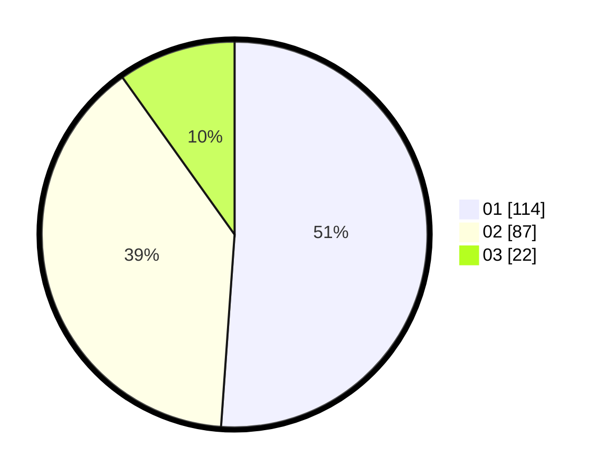

# Hasil

Hasil perolehan suara paslon dapat dilihat pada file paslon-01.txt, paslon-02.txt, dan paslon-03.txt.

Jika tidak ada, artinya data tersebut belum ada pada SIREKAP.

## Perolehan Suara

 * Paslon 01: **114**.
 * Paslon 02: **87**.
 * Paslon 03: **22**.

## Foto C Plano

https://sirekap-obj-formc.kpu.go.id/fa7e/pemilu/ppwp/31/75/02/10/04/3175021004036-20240216-020757--013a83bb-f255-4055-af6e-684c6182c838.jpg

https://sirekap-obj-formc.kpu.go.id/fa7e/pemilu/ppwp/31/75/02/10/04/3175021004036-20240214-155131--0d701ed4-a87b-402a-b639-73c524cfdd8d.jpg

https://sirekap-obj-formc.kpu.go.id/fa7e/pemilu/ppwp/31/75/02/10/04/3175021004036-20240216-022059--0aab77f6-d67d-49d4-9a12-6d68e8884a5e.jpg

## DATA PEMILIH TETAP

Jumlah pemilih dalam DPT: **271**.
 * L: **137**.
 * P: **134**.

## DATA PENGGUNA HAK PILIH

Jumlah pengguna hak pilih dalam DPT: **219**.
 * L: **109**.
 * P: **110**.

Jumlah pengguna hak pilih dalam DPTb: **3**.
 * L: **1**.
 * P: **2**.

Jumlah pengguna hak pilih dalam DPK: **2**.
 * L: **1**.
 * P: **1**.

Jumlah pengguna hak pilih: **224**.
 * L: **111**.
 * P: **113**.

## JUMLAH SUARA SAH DAN TIDAK SAH

JUMLAH SELURUH SUARA SAH: **223**.

JUMLAH SUARA TIDAK SAH: **1**.

JUMLAH SELURUH SUARA SAH DAN SUARA TIDAK SAH: **224**.
