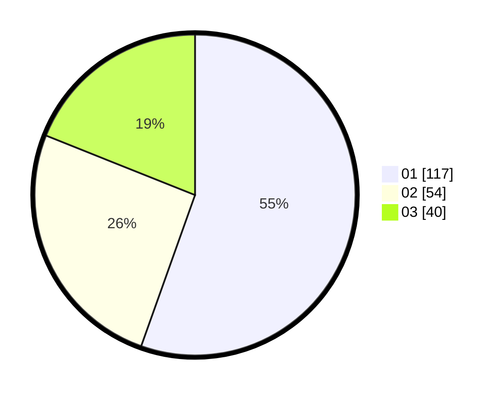

# Hasil

Hasil perolehan suara paslon dapat dilihat pada file paslon-01.txt, paslon-02.txt, dan paslon-03.txt.

Jika tidak ada, artinya data tersebut belum ada pada SIREKAP.

## Perolehan Suara

 * Paslon 01: **117**.
 * Paslon 02: **54**.
 * Paslon 03: **40**.

## Foto C Plano

https://sirekap-obj-formc.kpu.go.id/7c4b/pemilu/ppwp/31/75/02/10/04/3175021004039-20240216-132901--5ded814f-b62c-49d6-8b27-ed8de7486b3e.jpg

https://sirekap-obj-formc.kpu.go.id/7c4b/pemilu/ppwp/31/75/02/10/04/3175021004039-20240216-132902--b2e89330-2aac-49a6-ad95-193128792ba2.jpg

https://sirekap-obj-formc.kpu.go.id/7c4b/pemilu/ppwp/31/75/02/10/04/3175021004039-20240216-132901--56ff006d-5312-462f-a664-c23d232f21ad.jpg

## DATA PEMILIH TETAP

Jumlah pemilih dalam DPT: **268**.
 * L: **133**.
 * P: **135**.

## DATA PENGGUNA HAK PILIH

Jumlah pengguna hak pilih dalam DPT: **211**.
 * L: **101**.
 * P: **110**.

Jumlah pengguna hak pilih dalam DPTb: **0**.
 * L: **0**.
 * P: **0**.

Jumlah pengguna hak pilih dalam DPK: **1**.
 * L: **0**.
 * P: **1**.

Jumlah pengguna hak pilih: **212**.
 * L: **101**.
 * P: **111**.

## JUMLAH SUARA SAH DAN TIDAK SAH

JUMLAH SELURUH SUARA SAH: **211**.

JUMLAH SUARA TIDAK SAH: **1**.

JUMLAH SELURUH SUARA SAH DAN SUARA TIDAK SAH: **212**.
