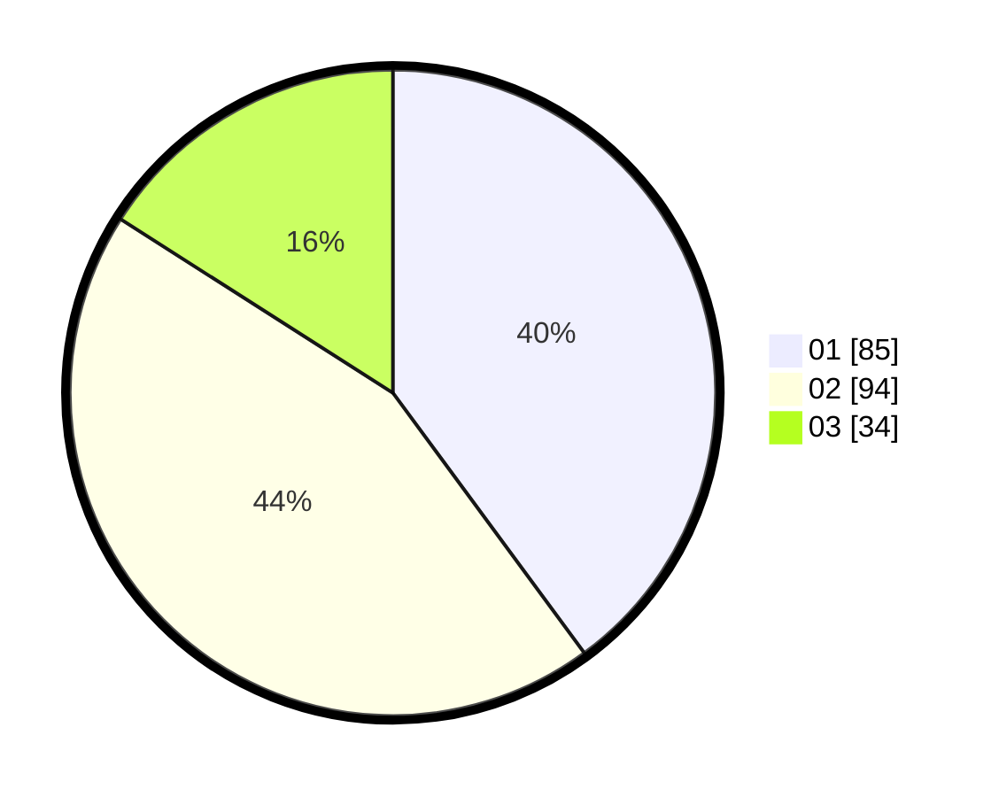

# Hasil

Hasil perolehan suara paslon dapat dilihat pada file paslon-01.txt, paslon-02.txt, dan paslon-03.txt.

Jika tidak ada, artinya data tersebut belum ada pada SIREKAP.

## Perolehan Suara

 * Paslon 01: **85**.
 * Paslon 02: **94**.
 * Paslon 03: **34**.

## Foto C Plano

https://sirekap-obj-formc.kpu.go.id/45e4/pemilu/ppwp/31/75/02/10/04/3175021004042-20240215-215817--2150ad20-8191-4a25-bbf2-4ef48645d76b.jpg

https://sirekap-obj-formc.kpu.go.id/45e4/pemilu/ppwp/31/75/02/10/04/3175021004042-20240215-215819--68311966-fbf9-4472-8b22-a2442c10636c.jpg

https://sirekap-obj-formc.kpu.go.id/45e4/pemilu/ppwp/31/75/02/10/04/3175021004042-20240215-215817--9051c6d4-db23-461a-bdf1-4bd135457c34.jpg

## DATA PEMILIH TETAP

Jumlah pemilih dalam DPT: **273**.
 * L: **146**.
 * P: **127**.

## DATA PENGGUNA HAK PILIH

Jumlah pengguna hak pilih dalam DPT: **214**.
 * L: **107**.
 * P: **107**.

Jumlah pengguna hak pilih dalam DPTb: **2**.
 * L: **1**.
 * P: **1**.

Jumlah pengguna hak pilih dalam DPK: **0**.
 * L: **0**.
 * P: **0**.

Jumlah pengguna hak pilih: **216**.
 * L: **108**.
 * P: **108**.

## JUMLAH SUARA SAH DAN TIDAK SAH

JUMLAH SELURUH SUARA SAH: **213**.

JUMLAH SUARA TIDAK SAH: **3**.

JUMLAH SELURUH SUARA SAH DAN SUARA TIDAK SAH: **216**.
