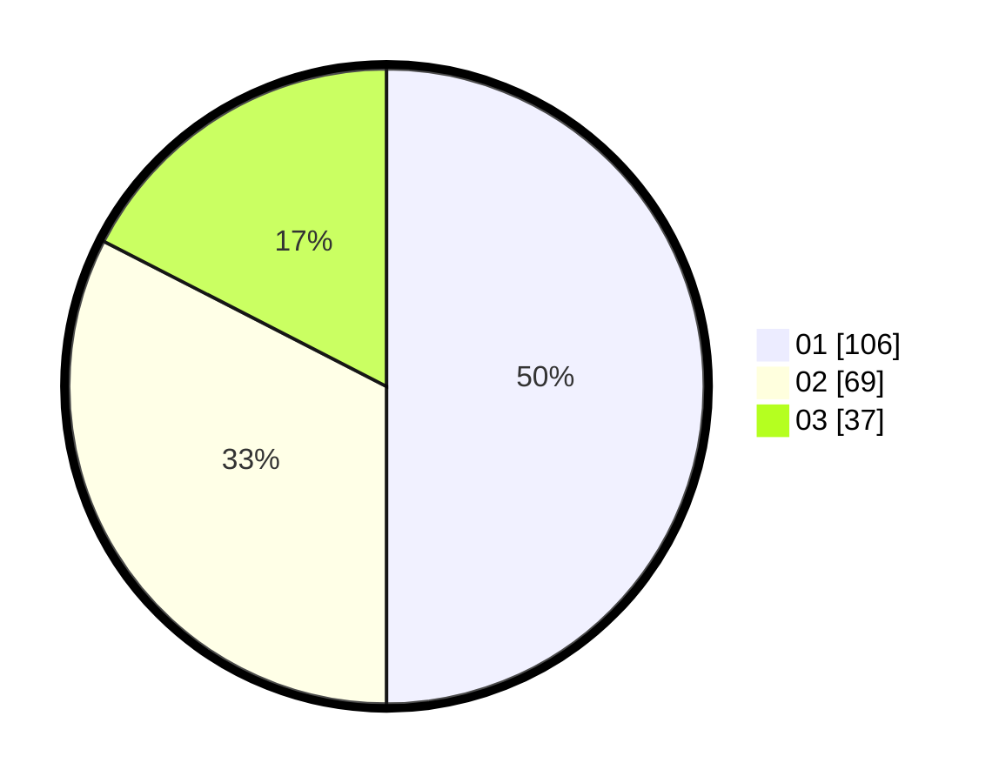

# Hasil

Hasil perolehan suara paslon dapat dilihat pada file paslon-01.txt, paslon-02.txt, dan paslon-03.txt.

Jika tidak ada, artinya data tersebut belum ada pada SIREKAP.

## Perolehan Suara

 * Paslon 01: **106**.
 * Paslon 02: **69**.
 * Paslon 03: **37**.

## Foto C Plano

https://sirekap-obj-formc.kpu.go.id/fe45/pemilu/ppwp/31/75/02/10/04/3175021004045-20240216-015047--0d070d98-df11-4e64-af20-986c15dca2d1.jpg

https://sirekap-obj-formc.kpu.go.id/fe45/pemilu/ppwp/31/75/02/10/04/3175021004045-20240216-021358--207666f4-ca8d-48f5-8d40-0d57548b5180.jpg

https://sirekap-obj-formc.kpu.go.id/fe45/pemilu/ppwp/31/75/02/10/04/3175021004045-20240216-015056--57c98c8a-518a-4b2e-9d99-a4eeba00cf46.jpg

## DATA PEMILIH TETAP

Jumlah pemilih dalam DPT: **266**.
 * L: **137**.
 * P: **129**.

## DATA PENGGUNA HAK PILIH

Jumlah pengguna hak pilih dalam DPT: **210**.
 * L: **104**.
 * P: **106**.

Jumlah pengguna hak pilih dalam DPTb: **0**.
 * L: **0**.
 * P: **0**.

Jumlah pengguna hak pilih dalam DPK: **4**.
 * L: **2**.
 * P: **2**.

Jumlah pengguna hak pilih: **214**.
 * L: **106**.
 * P: **108**.

## JUMLAH SUARA SAH DAN TIDAK SAH

JUMLAH SELURUH SUARA SAH: **212**.

JUMLAH SUARA TIDAK SAH: **2**.

JUMLAH SELURUH SUARA SAH DAN SUARA TIDAK SAH: **214**.
