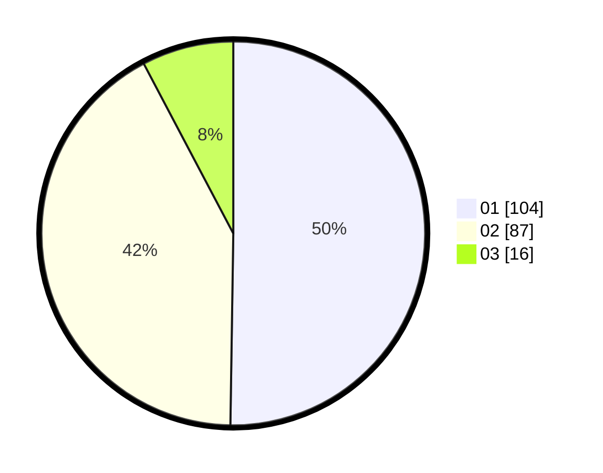

# Hasil

Hasil perolehan suara paslon dapat dilihat pada file paslon-01.txt, paslon-02.txt, dan paslon-03.txt.

Jika tidak ada, artinya data tersebut belum ada pada SIREKAP.

## Perolehan Suara

 * Paslon 01: **104**.
 * Paslon 02: **87**.
 * Paslon 03: **16**.

## Foto C Plano

https://sirekap-obj-formc.kpu.go.id/8e09/pemilu/ppwp/31/75/02/10/04/3175021004048-20240214-210010--09ef9798-eaac-4436-9a80-4cc589acecd5.jpg

https://sirekap-obj-formc.kpu.go.id/8e09/pemilu/ppwp/31/75/02/10/04/3175021004048-20240214-210107--886b3ffa-0d7d-40de-a8b8-449831f1d855.jpg

https://sirekap-obj-formc.kpu.go.id/8e09/pemilu/ppwp/31/75/02/10/04/3175021004048-20240214-210133--f6f6f7ca-6852-484c-93c6-b7fb890b225f.jpg

## DATA PEMILIH TETAP

Jumlah pemilih dalam DPT: **264**.
 * L: **134**.
 * P: **130**.

## DATA PENGGUNA HAK PILIH

Jumlah pengguna hak pilih dalam DPT: **212**.
 * L: **100**.
 * P: **112**.

Jumlah pengguna hak pilih dalam DPTb: **0**.
 * L: **0**.
 * P: **0**.

Jumlah pengguna hak pilih dalam DPK: **0**.
 * L: **0**.
 * P: **0**.

Jumlah pengguna hak pilih: **212**.
 * L: **100**.
 * P: **112**.

## JUMLAH SUARA SAH DAN TIDAK SAH

JUMLAH SELURUH SUARA SAH: **207**.

JUMLAH SUARA TIDAK SAH: **5**.

JUMLAH SELURUH SUARA SAH DAN SUARA TIDAK SAH: **212**.
