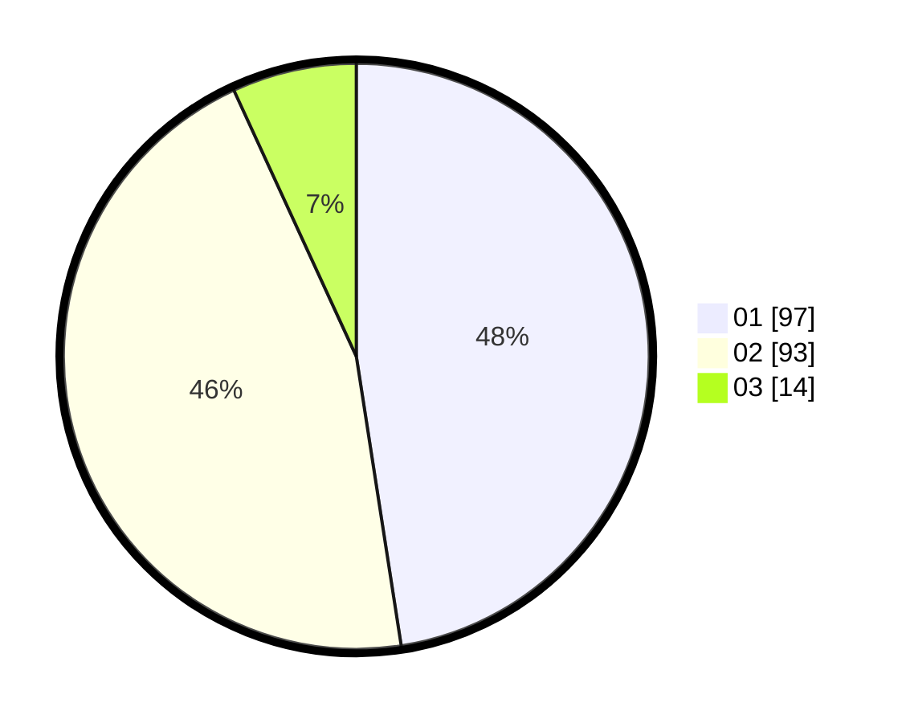

# Hasil

Hasil perolehan suara paslon dapat dilihat pada file paslon-01.txt, paslon-02.txt, dan paslon-03.txt.

Jika tidak ada, artinya data tersebut belum ada pada SIREKAP.

## Perolehan Suara

 * Paslon 01: **97**.
 * Paslon 02: **93**.
 * Paslon 03: **14**.

## Foto C Plano

https://sirekap-obj-formc.kpu.go.id/d2e9/pemilu/ppwp/31/75/02/10/04/3175021004050-20240214-203147--cf7aa311-817b-4cc1-904d-bc66f22f0258.jpg

https://sirekap-obj-formc.kpu.go.id/d2e9/pemilu/ppwp/31/75/02/10/04/3175021004050-20240214-203315--86424bf2-3392-4407-9b93-e6df3b0bae63.jpg

https://sirekap-obj-formc.kpu.go.id/d2e9/pemilu/ppwp/31/75/02/10/04/3175021004050-20240214-203401--ab08126d-c7a7-4632-9c6c-9cb9ea56944b.jpg

## DATA PEMILIH TETAP

Jumlah pemilih dalam DPT: **262**.
 * L: **133**.
 * P: **129**.

## DATA PENGGUNA HAK PILIH

Jumlah pengguna hak pilih dalam DPT: **207**.
 * L: **102**.
 * P: **105**.

Jumlah pengguna hak pilih dalam DPTb: **2**.
 * L: **1**.
 * P: **1**.

Jumlah pengguna hak pilih dalam DPK: **0**.
 * L: **0**.
 * P: **0**.

Jumlah pengguna hak pilih: **209**.
 * L: **103**.
 * P: **106**.

## JUMLAH SUARA SAH DAN TIDAK SAH

JUMLAH SELURUH SUARA SAH: **204**.

JUMLAH SUARA TIDAK SAH: **5**.

JUMLAH SELURUH SUARA SAH DAN SUARA TIDAK SAH: **209**.
