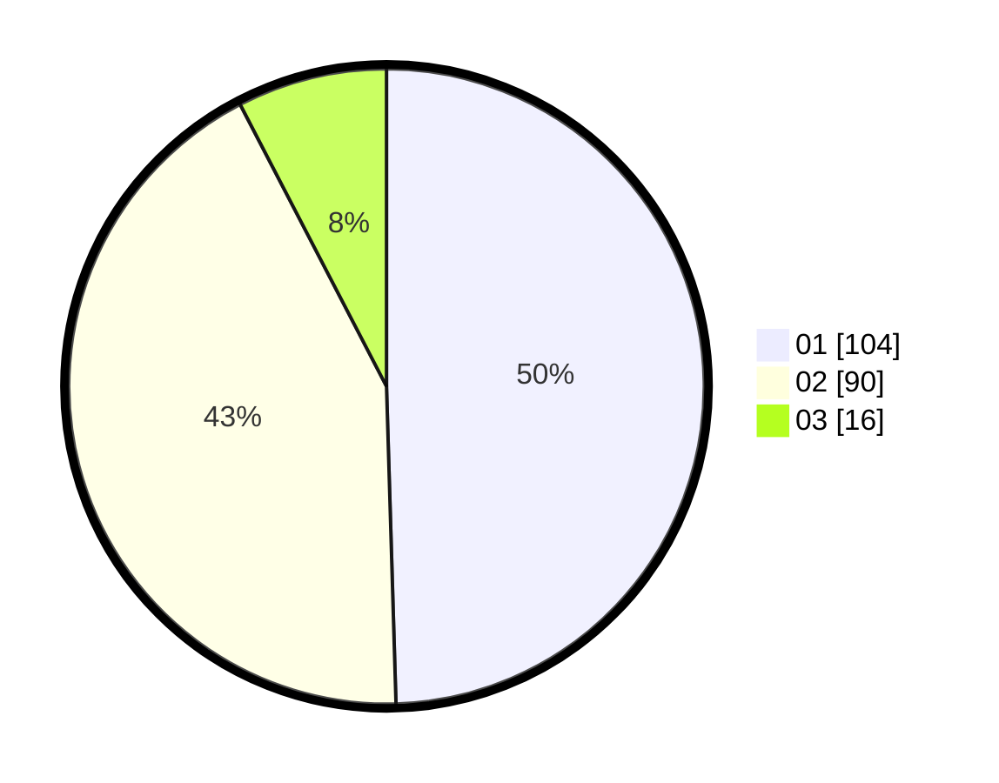

# Hasil

Hasil perolehan suara paslon dapat dilihat pada file paslon-01.txt, paslon-02.txt, dan paslon-03.txt.

Jika tidak ada, artinya data tersebut belum ada pada SIREKAP.

## Perolehan Suara

 * Paslon 01: **104**.
 * Paslon 02: **90**.
 * Paslon 03: **16**.

## Foto C Plano

https://sirekap-obj-formc.kpu.go.id/c0b8/pemilu/ppwp/31/75/02/10/04/3175021004053-20240216-154253--6a35d347-b193-4e4d-a4f4-ff3da74c5933.jpg

https://sirekap-obj-formc.kpu.go.id/c0b8/pemilu/ppwp/31/75/02/10/04/3175021004053-20240216-154254--6b142267-04cd-4162-9ec6-11c26b22ecb2.jpg

https://sirekap-obj-formc.kpu.go.id/c0b8/pemilu/ppwp/31/75/02/10/04/3175021004053-20240216-154254--53595037-d103-4e45-96d9-72365aab453c.jpg

## DATA PEMILIH TETAP

Jumlah pemilih dalam DPT: **216**.
 * L: **101**.
 * P: **116**.

## DATA PENGGUNA HAK PILIH

Jumlah pengguna hak pilih dalam DPT: **216**.
 * L: **101**.
 * P: **115**.

Jumlah pengguna hak pilih dalam DPTb: **1**.
 * L: **0**.
 * P: **1**.

Jumlah pengguna hak pilih dalam DPK: **0**.
 * L: **0**.
 * P: **0**.

Jumlah pengguna hak pilih: **217**.
 * L: **101**.
 * P: **116**.

## JUMLAH SUARA SAH DAN TIDAK SAH

JUMLAH SELURUH SUARA SAH: **210**.

JUMLAH SUARA TIDAK SAH: **7**.

JUMLAH SELURUH SUARA SAH DAN SUARA TIDAK SAH: **217**.
