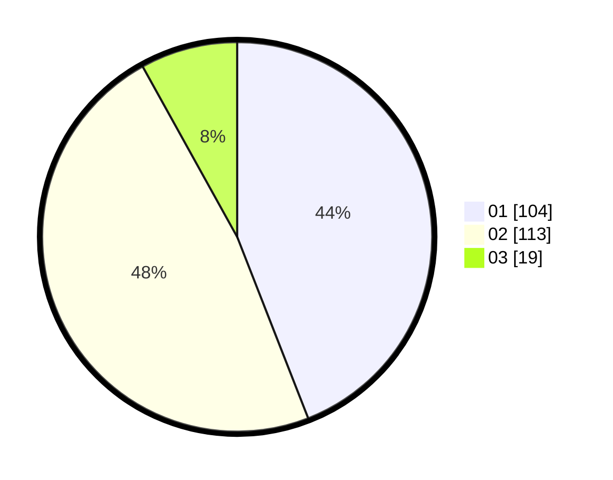

# Hasil

Hasil perolehan suara paslon dapat dilihat pada file paslon-01.txt, paslon-02.txt, dan paslon-03.txt.

Jika tidak ada, artinya data tersebut belum ada pada SIREKAP.

## Perolehan Suara

 * Paslon 01: **104**.
 * Paslon 02: **113**.
 * Paslon 03: **19**.

## Foto C Plano

https://sirekap-obj-formc.kpu.go.id/e3dc/pemilu/ppwp/31/75/02/10/04/3175021004056-20240215-055102--92ab9581-c907-4ce7-9fe1-71f6f7687949.jpg

https://sirekap-obj-formc.kpu.go.id/e3dc/pemilu/ppwp/31/75/02/10/04/3175021004056-20240215-055130--9fb9aaa2-70b4-402f-aae8-f375d973f3dd.jpg

https://sirekap-obj-formc.kpu.go.id/e3dc/pemilu/ppwp/31/75/02/10/04/3175021004056-20240215-055112--4f2f76a6-498e-4815-8bd6-ff9400b1ef87.jpg

## DATA PEMILIH TETAP

Jumlah pemilih dalam DPT: **279**.
 * L: **147**.
 * P: **132**.

## DATA PENGGUNA HAK PILIH

Jumlah pengguna hak pilih dalam DPT: **238**.
 * L: **119**.
 * P: **119**.

Jumlah pengguna hak pilih dalam DPTb: **2**.
 * L: **2**.
 * P: **0**.

Jumlah pengguna hak pilih dalam DPK: **0**.
 * L: **0**.
 * P: **0**.

Jumlah pengguna hak pilih: **240**.
 * L: **121**.
 * P: **119**.

## JUMLAH SUARA SAH DAN TIDAK SAH

JUMLAH SELURUH SUARA SAH: **236**.

JUMLAH SUARA TIDAK SAH: **2**.

JUMLAH SELURUH SUARA SAH DAN SUARA TIDAK SAH: **238**.
