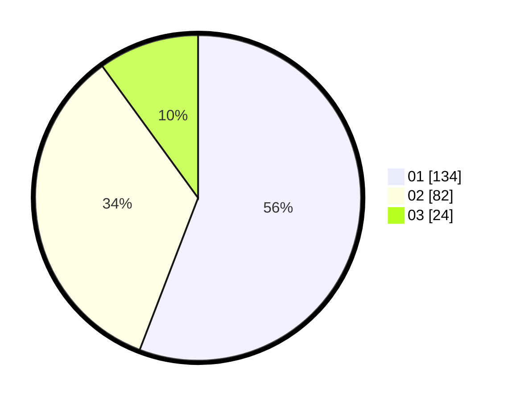

# Hasil

Hasil perolehan suara paslon dapat dilihat pada file paslon-01.txt, paslon-02.txt, dan paslon-03.txt.

Jika tidak ada, artinya data tersebut belum ada pada SIREKAP.

## Perolehan Suara

 * Paslon 01: **134**.
 * Paslon 02: **82**.
 * Paslon 03: **24**.

## Foto C Plano

https://sirekap-obj-formc.kpu.go.id/40a5/pemilu/ppwp/31/75/02/10/04/3175021004058-20240216-151105--045e6618-c5b4-4540-993f-d829256a5bc8.jpg

https://sirekap-obj-formc.kpu.go.id/40a5/pemilu/ppwp/31/75/02/10/04/3175021004058-20240216-151106--98585df4-053b-457e-8e27-ebae30a4a81b.jpg

https://sirekap-obj-formc.kpu.go.id/40a5/pemilu/ppwp/31/75/02/10/04/3175021004058-20240216-151106--e598d8cc-eb17-4bda-972b-fc42c3114088.jpg

## DATA PEMILIH TETAP

Jumlah pemilih dalam DPT: **289**.
 * L: **146**.
 * P: **143**.

## DATA PENGGUNA HAK PILIH

Jumlah pengguna hak pilih dalam DPT: **244**.
 * L: **120**.
 * P: **124**.

Jumlah pengguna hak pilih dalam DPTb: **1**.
 * L: **0**.
 * P: **1**.

Jumlah pengguna hak pilih dalam DPK: **0**.
 * L: **0**.
 * P: **0**.

Jumlah pengguna hak pilih: **245**.
 * L: **120**.
 * P: **125**.

## JUMLAH SUARA SAH DAN TIDAK SAH

JUMLAH SELURUH SUARA SAH: **240**.

JUMLAH SUARA TIDAK SAH: **5**.

JUMLAH SELURUH SUARA SAH DAN SUARA TIDAK SAH: **245**.
