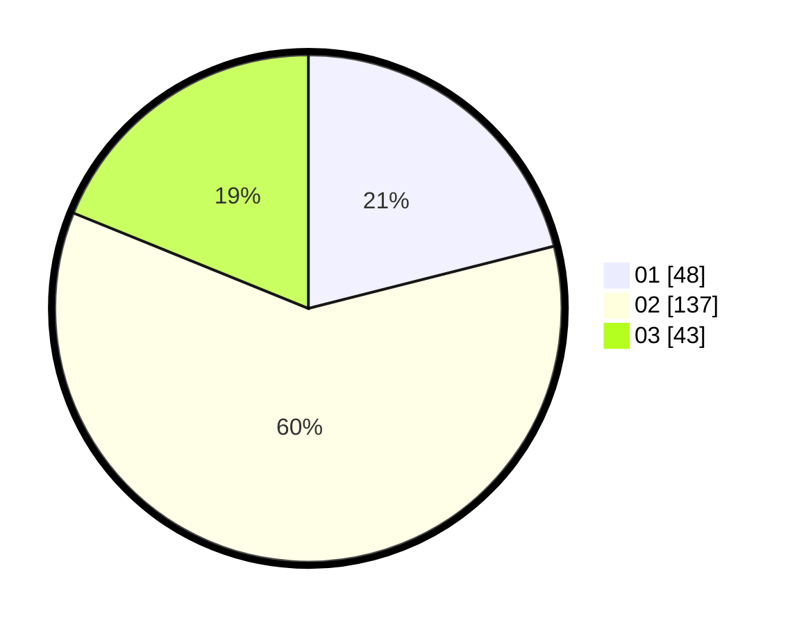

# Hasil

Hasil perolehan suara paslon dapat dilihat pada file paslon-01.txt, paslon-02.txt, dan paslon-03.txt.

Jika tidak ada, artinya data tersebut belum ada pada SIREKAP.

## Perolehan Suara

 * Paslon 01: **48**.
 * Paslon 02: **137**.
 * Paslon 03: **43**.

## Foto C Plano

https://sirekap-obj-formc.kpu.go.id/b90f/pemilu/ppwp/31/75/02/10/04/3175021004063-20240216-070205--ccb2008b-5dfb-45b2-ac00-eadfe5e67b32.jpg

https://sirekap-obj-formc.kpu.go.id/b90f/pemilu/ppwp/31/75/02/10/04/3175021004063-20240216-070207--ba93eb1d-508d-478c-b2f4-15d2f915360a.jpg

https://sirekap-obj-formc.kpu.go.id/b90f/pemilu/ppwp/31/75/02/10/04/3175021004063-20240216-070206--c9197be1-1db8-4f36-b4c0-ba2d1ff64c97.jpg

## DATA PEMILIH TETAP

Jumlah pemilih dalam DPT: **281**.
 * L: **130**.
 * P: **151**.

## DATA PENGGUNA HAK PILIH

Jumlah pengguna hak pilih dalam DPT: **228**.
 * L: **104**.
 * P: **124**.

Jumlah pengguna hak pilih dalam DPTb: **0**.
 * L: **0**.
 * P: **0**.

Jumlah pengguna hak pilih dalam DPK: **0**.
 * L: **0**.
 * P: **0**.

Jumlah pengguna hak pilih: **228**.
 * L: **104**.
 * P: **124**.

## JUMLAH SUARA SAH DAN TIDAK SAH

JUMLAH SELURUH SUARA SAH: **228**.

JUMLAH SUARA TIDAK SAH: **0**.

JUMLAH SELURUH SUARA SAH DAN SUARA TIDAK SAH: **228**.
