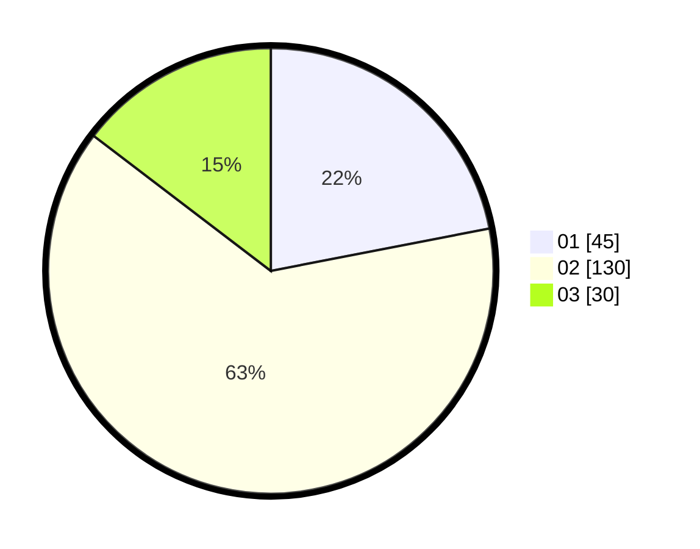

# Hasil

Hasil perolehan suara paslon dapat dilihat pada file paslon-01.txt, paslon-02.txt, dan paslon-03.txt.

Jika tidak ada, artinya data tersebut belum ada pada SIREKAP.

## Perolehan Suara

 * Paslon 01: **45**.
 * Paslon 02: **130**.
 * Paslon 03: **30**.

## Foto C Plano

https://sirekap-obj-formc.kpu.go.id/1971/pemilu/ppwp/31/75/02/10/04/3175021004064-20240216-115510--09a66c0a-8c8d-44ac-929c-537d23cdf24c.jpg

https://sirekap-obj-formc.kpu.go.id/1971/pemilu/ppwp/31/75/02/10/04/3175021004064-20240216-115512--f210ff97-5eb3-4911-8b4e-7d19a22214bb.jpg

https://sirekap-obj-formc.kpu.go.id/1971/pemilu/ppwp/31/75/02/10/04/3175021004064-20240216-115511--994510d5-e25c-4ecf-a625-d87c7ba1fb38.jpg

## DATA PEMILIH TETAP

Jumlah pemilih dalam DPT: **278**.
 * L: **126**.
 * P: **152**.

## DATA PENGGUNA HAK PILIH

Jumlah pengguna hak pilih dalam DPT: **205**.
 * L: **89**.
 * P: **116**.

Jumlah pengguna hak pilih dalam DPTb: **0**.
 * L: **0**.
 * P: **0**.

Jumlah pengguna hak pilih dalam DPK: **2**.
 * L: **1**.
 * P: **1**.

Jumlah pengguna hak pilih: **207**.
 * L: **90**.
 * P: **117**.

## JUMLAH SUARA SAH DAN TIDAK SAH

JUMLAH SELURUH SUARA SAH: **205**.

JUMLAH SUARA TIDAK SAH: **2**.

JUMLAH SELURUH SUARA SAH DAN SUARA TIDAK SAH: **207**.
