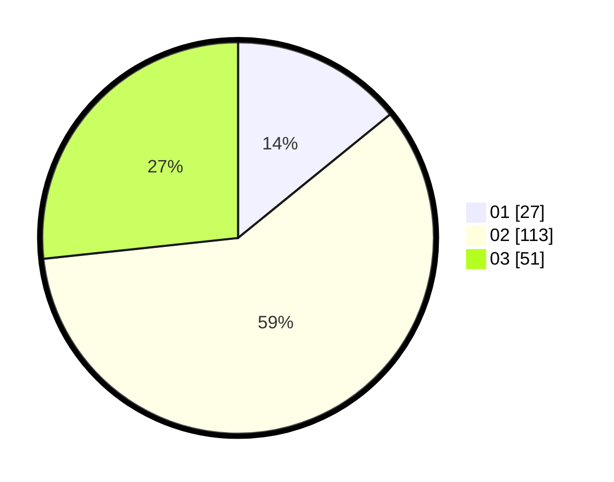

# Hasil

Hasil perolehan suara paslon dapat dilihat pada file paslon-01.txt, paslon-02.txt, dan paslon-03.txt.

Jika tidak ada, artinya data tersebut belum ada pada SIREKAP.

## Perolehan Suara

 * Paslon 01: **27**.
 * Paslon 02: **113**.
 * Paslon 03: **51**.

## Foto C Plano

https://sirekap-obj-formc.kpu.go.id/123f/pemilu/ppwp/31/75/02/10/04/3175021004065-20240216-041633--6b5f018c-21cf-46eb-8df1-006f16aa0a3e.jpg

https://sirekap-obj-formc.kpu.go.id/123f/pemilu/ppwp/31/75/02/10/04/3175021004065-20240216-041646--7fa46405-d4c3-4893-874a-d15f2b4a6214.jpg

https://sirekap-obj-formc.kpu.go.id/123f/pemilu/ppwp/31/75/02/10/04/3175021004065-20240216-041642--415359c8-02d1-4b6e-b9cb-1bcec6833db6.jpg

## DATA PEMILIH TETAP

Jumlah pemilih dalam DPT: **278**.
 * L: **125**.
 * P: **153**.

## DATA PENGGUNA HAK PILIH

Jumlah pengguna hak pilih dalam DPT: **191**.
 * L: **80**.
 * P: **111**.

Jumlah pengguna hak pilih dalam DPTb: **0**.
 * L: **0**.
 * P: **0**.

Jumlah pengguna hak pilih dalam DPK: **1**.
 * L: **1**.
 * P: **0**.

Jumlah pengguna hak pilih: **192**.
 * L: **81**.
 * P: **111**.

## JUMLAH SUARA SAH DAN TIDAK SAH

JUMLAH SELURUH SUARA SAH: **191**.

JUMLAH SUARA TIDAK SAH: **1**.

JUMLAH SELURUH SUARA SAH DAN SUARA TIDAK SAH: **192**.
