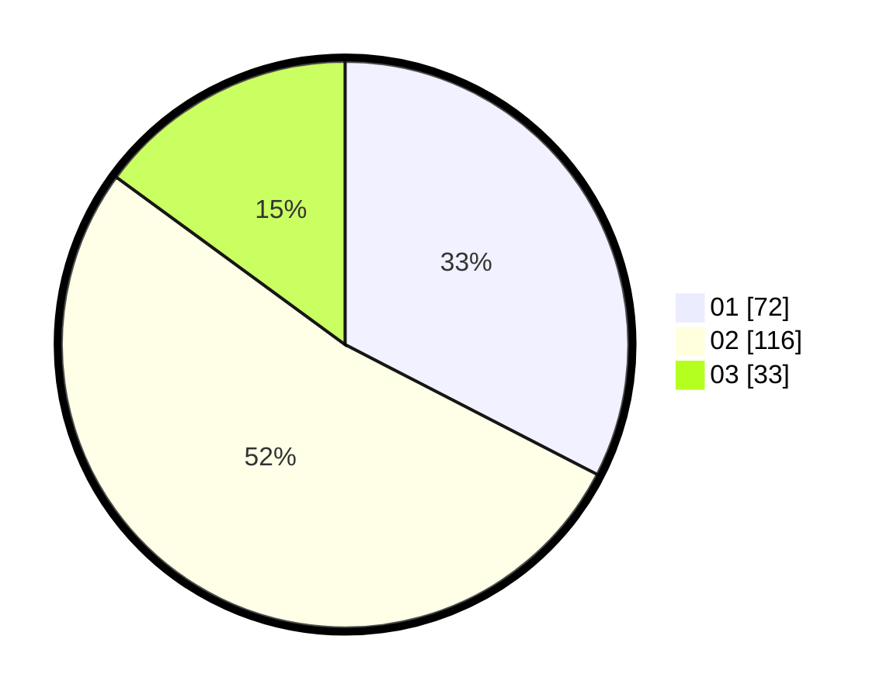

# Hasil

Hasil perolehan suara paslon dapat dilihat pada file paslon-01.txt, paslon-02.txt, dan paslon-03.txt.

Jika tidak ada, artinya data tersebut belum ada pada SIREKAP.

## Perolehan Suara

 * Paslon 01: **72**.
 * Paslon 02: **116**.
 * Paslon 03: **33**.

## Foto C Plano

https://sirekap-obj-formc.kpu.go.id/8178/pemilu/ppwp/31/75/02/10/04/3175021004070-20240216-073950--898ca170-1786-45b9-ad13-965b56d1a104.jpg

https://sirekap-obj-formc.kpu.go.id/8178/pemilu/ppwp/31/75/02/10/04/3175021004070-20240216-051339--0bd1a2f0-c1e1-4210-8d3d-0cc39926baa5.jpg

https://sirekap-obj-formc.kpu.go.id/8178/pemilu/ppwp/31/75/02/10/04/3175021004070-20240216-051337--94e09916-64ea-49aa-a33e-468bb5613774.jpg

## DATA PEMILIH TETAP

Jumlah pemilih dalam DPT: **283**.
 * L: **139**.
 * P: **144**.

## DATA PENGGUNA HAK PILIH

Jumlah pengguna hak pilih dalam DPT: **220**.
 * L: **100**.
 * P: **120**.

Jumlah pengguna hak pilih dalam DPTb: **2**.
 * L: **0**.
 * P: **2**.

Jumlah pengguna hak pilih dalam DPK: **1**.
 * L: **1**.
 * P: **0**.

Jumlah pengguna hak pilih: **223**.
 * L: **101**.
 * P: **122**.

## JUMLAH SUARA SAH DAN TIDAK SAH

JUMLAH SELURUH SUARA SAH: **221**.

JUMLAH SUARA TIDAK SAH: **2**.

JUMLAH SELURUH SUARA SAH DAN SUARA TIDAK SAH: **223**.
