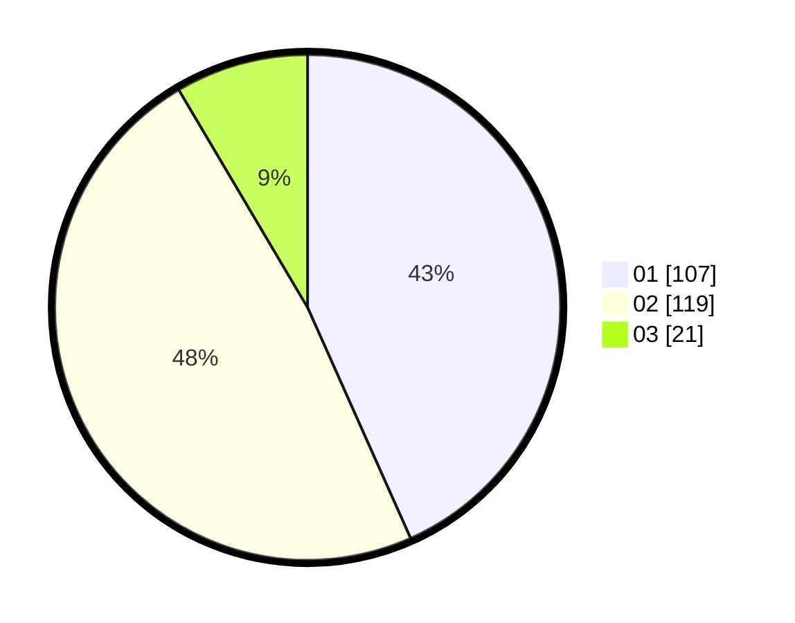

# Hasil

Hasil perolehan suara paslon dapat dilihat pada file paslon-01.txt, paslon-02.txt, dan paslon-03.txt.

Jika tidak ada, artinya data tersebut belum ada pada SIREKAP.

## Perolehan Suara

 * Paslon 01: **107**.
 * Paslon 02: **119**.
 * Paslon 03: **21**.

## Foto C Plano

https://sirekap-obj-formc.kpu.go.id/adf6/pemilu/ppwp/31/75/02/10/04/3175021004072-20240214-190825--75a90947-400f-4199-bfd9-a3d497ee39d6.jpg

https://sirekap-obj-formc.kpu.go.id/adf6/pemilu/ppwp/31/75/02/10/04/3175021004072-20240214-190949--f42d3915-3be4-45d2-b9d5-2124316f2aed.jpg

https://sirekap-obj-formc.kpu.go.id/adf6/pemilu/ppwp/31/75/02/10/04/3175021004072-20240214-191044--41a6e6ef-fd99-430e-bb30-3225f8f5857c.jpg

## DATA PEMILIH TETAP

Jumlah pemilih dalam DPT: **290**.
 * L: **143**.
 * P: **147**.

## DATA PENGGUNA HAK PILIH

Jumlah pengguna hak pilih dalam DPT: **246**.
 * L: **122**.
 * P: **124**.

Jumlah pengguna hak pilih dalam DPTb: **2**.
 * L: **1**.
 * P: **1**.

Jumlah pengguna hak pilih dalam DPK: **0**.
 * L: **0**.
 * P: **0**.

Jumlah pengguna hak pilih: **248**.
 * L: **123**.
 * P: **125**.

## JUMLAH SUARA SAH DAN TIDAK SAH

JUMLAH SELURUH SUARA SAH: **247**.

JUMLAH SUARA TIDAK SAH: **1**.

JUMLAH SELURUH SUARA SAH DAN SUARA TIDAK SAH: **248**.
