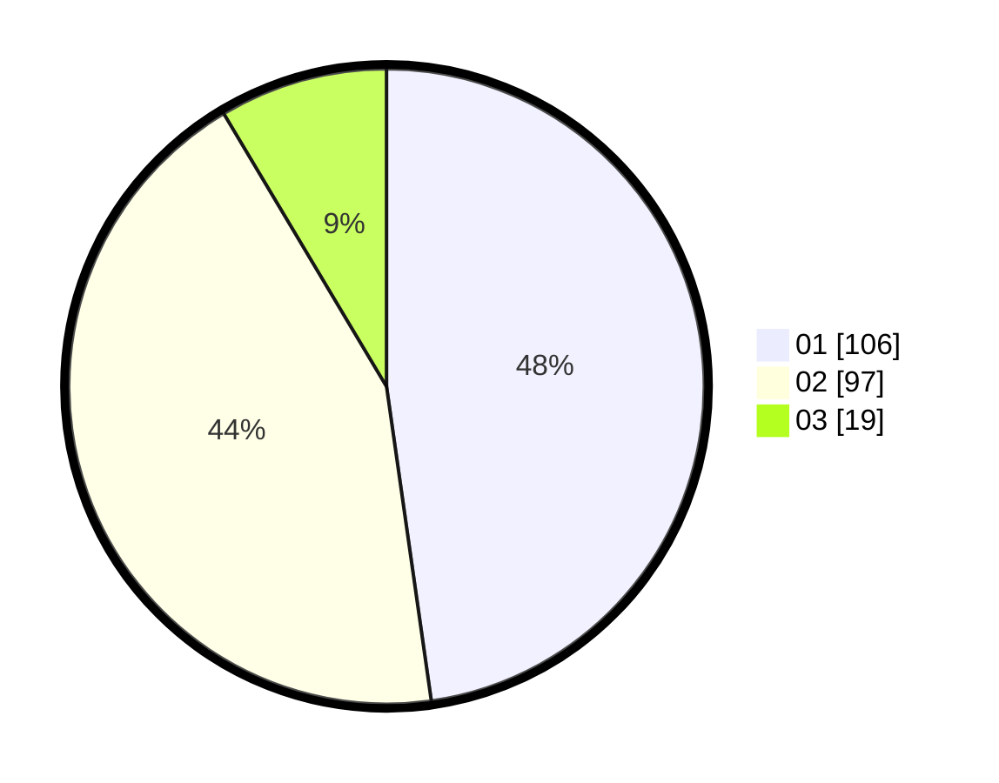

# Hasil

Hasil perolehan suara paslon dapat dilihat pada file paslon-01.txt, paslon-02.txt, dan paslon-03.txt.

Jika tidak ada, artinya data tersebut belum ada pada SIREKAP.

## Perolehan Suara

 * Paslon 01: **106**.
 * Paslon 02: **97**.
 * Paslon 03: **19**.

## Foto C Plano

https://sirekap-obj-formc.kpu.go.id/3f5e/pemilu/ppwp/31/75/02/10/04/3175021004078-20240214-214520--91150e44-cf1a-4b54-8e41-35f8134f0054.jpg

https://sirekap-obj-formc.kpu.go.id/3f5e/pemilu/ppwp/31/75/02/10/04/3175021004078-20240214-214541--26ca3086-a66e-4ff9-b9d3-c1ed6a031330.jpg

https://sirekap-obj-formc.kpu.go.id/3f5e/pemilu/ppwp/31/75/02/10/04/3175021004078-20240214-214531--6df134a3-c612-4e7a-952d-98cc429a2f66.jpg

## DATA PEMILIH TETAP

Jumlah pemilih dalam DPT: **263**.
 * L: **132**.
 * P: **131**.

## DATA PENGGUNA HAK PILIH

Jumlah pengguna hak pilih dalam DPT: **222**.
 * L: **110**.
 * P: **112**.

Jumlah pengguna hak pilih dalam DPTb: **1**.
 * L: **1**.
 * P: **0**.

Jumlah pengguna hak pilih dalam DPK: **0**.
 * L: **0**.
 * P: **0**.

Jumlah pengguna hak pilih: **223**.
 * L: **111**.
 * P: **112**.

## JUMLAH SUARA SAH DAN TIDAK SAH

JUMLAH SELURUH SUARA SAH: **222**.

JUMLAH SUARA TIDAK SAH: **1**.

JUMLAH SELURUH SUARA SAH DAN SUARA TIDAK SAH: **223**.
