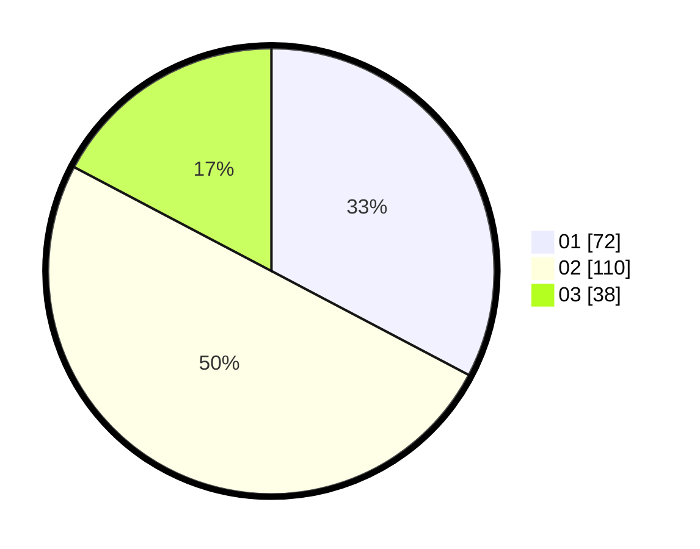

# Hasil

Hasil perolehan suara paslon dapat dilihat pada file paslon-01.txt, paslon-02.txt, dan paslon-03.txt.

Jika tidak ada, artinya data tersebut belum ada pada SIREKAP.

## Perolehan Suara

 * Paslon 01: **72**.
 * Paslon 02: **110**.
 * Paslon 03: **38**.

## Foto C Plano

https://sirekap-obj-formc.kpu.go.id/f151/pemilu/ppwp/31/75/02/10/04/3175021004080-20240214-162215--5b4f0692-0c5c-47f4-8025-275f324e9339.jpg

https://sirekap-obj-formc.kpu.go.id/f151/pemilu/ppwp/31/75/02/10/04/3175021004080-20240214-162220--c6bf4d23-02ca-4857-8812-7085adf798ad.jpg

https://sirekap-obj-formc.kpu.go.id/f151/pemilu/ppwp/31/75/02/10/04/3175021004080-20240214-162225--7d113378-6008-439c-b368-80805c7ca24b.jpg

## DATA PEMILIH TETAP

Jumlah pemilih dalam DPT: **270**.
 * L: **130**.
 * P: **140**.

## DATA PENGGUNA HAK PILIH

Jumlah pengguna hak pilih dalam DPT: **224**.
 * L: **105**.
 * P: **119**.

Jumlah pengguna hak pilih dalam DPTb: **1**.
 * L: **0**.
 * P: **1**.

Jumlah pengguna hak pilih dalam DPK: **1**.
 * L: **0**.
 * P: **1**.

Jumlah pengguna hak pilih: **226**.
 * L: **105**.
 * P: **121**.

## JUMLAH SUARA SAH DAN TIDAK SAH

JUMLAH SELURUH SUARA SAH: **220**.

JUMLAH SUARA TIDAK SAH: **6**.

JUMLAH SELURUH SUARA SAH DAN SUARA TIDAK SAH: **226**.
