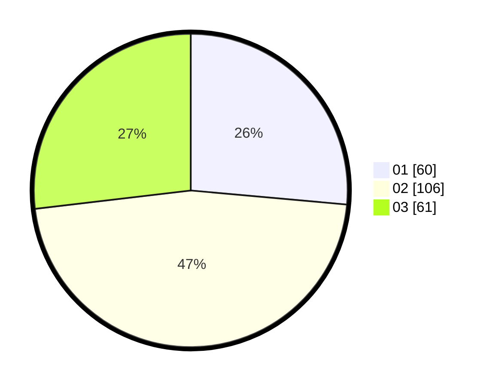

# Hasil

Hasil perolehan suara paslon dapat dilihat pada file paslon-01.txt, paslon-02.txt, dan paslon-03.txt.

Jika tidak ada, artinya data tersebut belum ada pada SIREKAP.

## Perolehan Suara

 * Paslon 01: **60**.
 * Paslon 02: **106**.
 * Paslon 03: **61**.

## Foto C Plano

https://sirekap-obj-formc.kpu.go.id/8d61/pemilu/ppwp/31/75/02/10/04/3175021004081-20240214-141752--c359c8ef-b115-4365-bda1-f4c8ee427729.jpg

https://sirekap-obj-formc.kpu.go.id/8d61/pemilu/ppwp/31/75/02/10/04/3175021004081-20240216-034852--cb5f2211-f060-4811-9be3-e046ca302d1a.jpg

https://sirekap-obj-formc.kpu.go.id/8d61/pemilu/ppwp/31/75/02/10/04/3175021004081-20240216-034847--eeba5641-cb29-43c7-944d-c7d7553b8e89.jpg

## DATA PEMILIH TETAP

Jumlah pemilih dalam DPT: **263**.
 * L: **130**.
 * P: **133**.

## DATA PENGGUNA HAK PILIH

Jumlah pengguna hak pilih dalam DPT: **228**.
 * L: **109**.
 * P: **119**.

Jumlah pengguna hak pilih dalam DPTb: **2**.
 * L: **1**.
 * P: **1**.

Jumlah pengguna hak pilih dalam DPK: **1**.
 * L: **1**.
 * P: **0**.

Jumlah pengguna hak pilih: **231**.
 * L: **111**.
 * P: **120**.

## JUMLAH SUARA SAH DAN TIDAK SAH

JUMLAH SELURUH SUARA SAH: **227**.

JUMLAH SUARA TIDAK SAH: **4**.

JUMLAH SELURUH SUARA SAH DAN SUARA TIDAK SAH: **231**.
