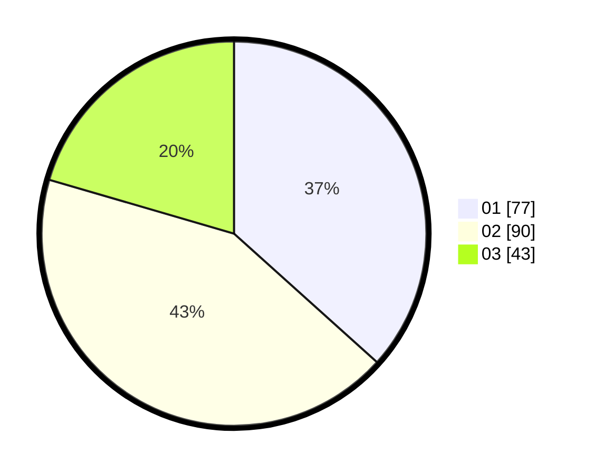

# Hasil

Hasil perolehan suara paslon dapat dilihat pada file paslon-01.txt, paslon-02.txt, dan paslon-03.txt.

Jika tidak ada, artinya data tersebut belum ada pada SIREKAP.

## Perolehan Suara

 * Paslon 01: **77**.
 * Paslon 02: **90**.
 * Paslon 03: **43**.

## Foto C Plano

https://sirekap-obj-formc.kpu.go.id/b354/pemilu/ppwp/31/75/02/10/05/3175021005002-20240215-204522--edd5d0f6-8431-49a5-9ce3-d23a561bd6b6.jpg

https://sirekap-obj-formc.kpu.go.id/b354/pemilu/ppwp/31/75/02/10/05/3175021005002-20240214-193406--79028356-599e-431d-8b1a-13f177a007fb.jpg

https://sirekap-obj-formc.kpu.go.id/b354/pemilu/ppwp/31/75/02/10/05/3175021005002-20240215-204523--57eceaa6-3f0d-478f-a0df-e4bf9a8d239a.jpg

## DATA PEMILIH TETAP

Jumlah pemilih dalam DPT: **263**.
 * L: **121**.
 * P: **142**.

## DATA PENGGUNA HAK PILIH

Jumlah pengguna hak pilih dalam DPT: **207**.
 * L: **94**.
 * P: **113**.

Jumlah pengguna hak pilih dalam DPTb: **4**.
 * L: **2**.
 * P: **2**.

Jumlah pengguna hak pilih dalam DPK: **0**.
 * L: **0**.
 * P: **0**.

Jumlah pengguna hak pilih: **211**.
 * L: **96**.
 * P: **115**.

## JUMLAH SUARA SAH DAN TIDAK SAH

JUMLAH SELURUH SUARA SAH: **210**.

JUMLAH SUARA TIDAK SAH: **1**.

JUMLAH SELURUH SUARA SAH DAN SUARA TIDAK SAH: **211**.
