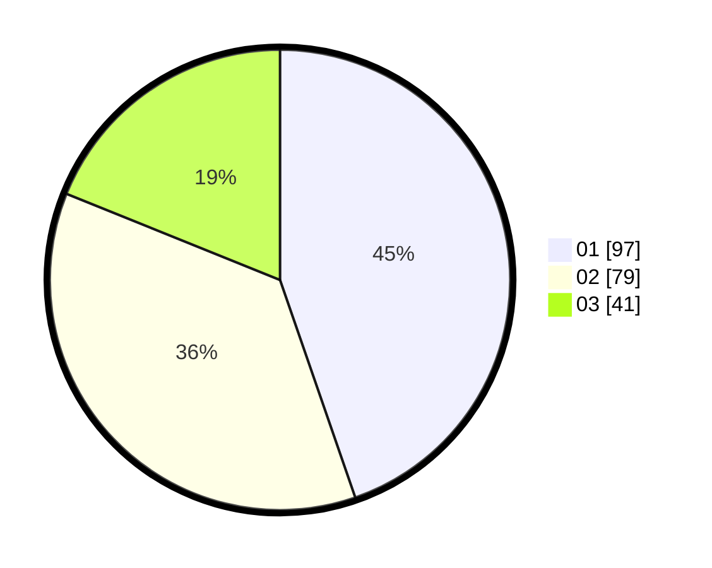

# Hasil

Hasil perolehan suara paslon dapat dilihat pada file paslon-01.txt, paslon-02.txt, dan paslon-03.txt.

Jika tidak ada, artinya data tersebut belum ada pada SIREKAP.

## Perolehan Suara

 * Paslon 01: **97**.
 * Paslon 02: **79**.
 * Paslon 03: **41**.

## Foto C Plano

https://sirekap-obj-formc.kpu.go.id/2af7/pemilu/ppwp/31/75/02/10/05/3175021005003-20240214-155505--5a33535d-97a2-4472-b835-33c2580cc96c.jpg

https://sirekap-obj-formc.kpu.go.id/2af7/pemilu/ppwp/31/75/02/10/05/3175021005003-20240214-155626--88dd6377-9cb3-47fc-b050-9dbc53df479b.jpg

https://sirekap-obj-formc.kpu.go.id/2af7/pemilu/ppwp/31/75/02/10/05/3175021005003-20240217-222553--f0a1ab18-f171-470e-93f9-c74a437aedcf.jpg

## DATA PEMILIH TETAP

Jumlah pemilih dalam DPT: **262**.
 * L: **133**.
 * P: **129**.

## DATA PENGGUNA HAK PILIH

Jumlah pengguna hak pilih dalam DPT: **216**.
 * L: **107**.
 * P: **109**.

Jumlah pengguna hak pilih dalam DPTb: **3**.
 * L: **0**.
 * P: **3**.

Jumlah pengguna hak pilih dalam DPK: **0**.
 * L: **0**.
 * P: **0**.

Jumlah pengguna hak pilih: **219**.
 * L: **107**.
 * P: **112**.

## JUMLAH SUARA SAH DAN TIDAK SAH

JUMLAH SELURUH SUARA SAH: **217**.

JUMLAH SUARA TIDAK SAH: **2**.

JUMLAH SELURUH SUARA SAH DAN SUARA TIDAK SAH: **219**.
