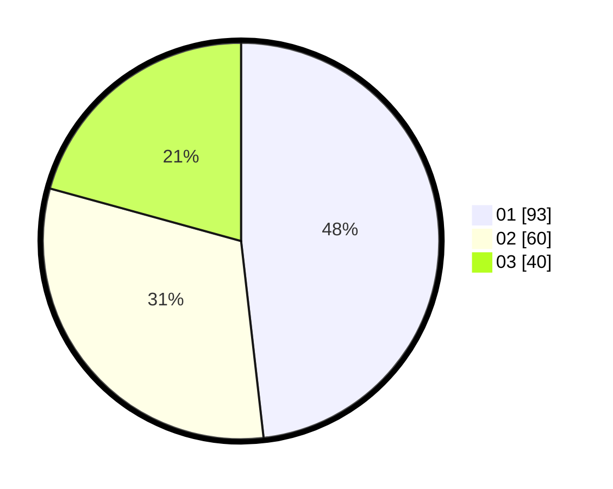

# Hasil

Hasil perolehan suara paslon dapat dilihat pada file paslon-01.txt, paslon-02.txt, dan paslon-03.txt.

Jika tidak ada, artinya data tersebut belum ada pada SIREKAP.

## Perolehan Suara

 * Paslon 01: **93**.
 * Paslon 02: **60**.
 * Paslon 03: **40**.

## Foto C Plano

https://sirekap-obj-formc.kpu.go.id/d25c/pemilu/ppwp/31/75/02/10/05/3175021005004-20240215-213852--9203023c-6060-4a5b-8dbc-35943f881bf1.jpg

https://sirekap-obj-formc.kpu.go.id/d25c/pemilu/ppwp/31/75/02/10/05/3175021005004-20240215-213854--f16baf3b-9dd1-4c5a-9271-8ad44b23bdac.jpg

https://sirekap-obj-formc.kpu.go.id/d25c/pemilu/ppwp/31/75/02/10/05/3175021005004-20240215-213853--33e50b18-77e0-4324-86cf-76a980e609f3.jpg

## DATA PEMILIH TETAP

Jumlah pemilih dalam DPT: **260**.
 * L: **118**.
 * P: **142**.

## DATA PENGGUNA HAK PILIH

Jumlah pengguna hak pilih dalam DPT: **195**.
 * L: **91**.
 * P: **104**.

Jumlah pengguna hak pilih dalam DPTb: **0**.
 * L: **0**.
 * P: **0**.

Jumlah pengguna hak pilih dalam DPK: **1**.
 * L: **1**.
 * P: **0**.

Jumlah pengguna hak pilih: **196**.
 * L: **92**.
 * P: **104**.

## JUMLAH SUARA SAH DAN TIDAK SAH

JUMLAH SELURUH SUARA SAH: **193**.

JUMLAH SUARA TIDAK SAH: **3**.

JUMLAH SELURUH SUARA SAH DAN SUARA TIDAK SAH: **196**.
