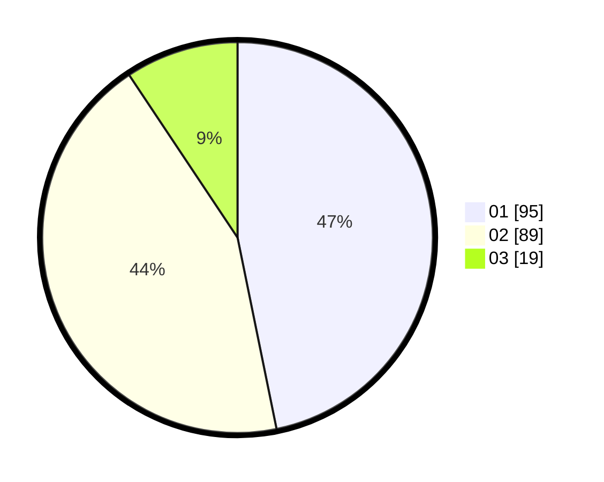

# Hasil

Hasil perolehan suara paslon dapat dilihat pada file paslon-01.txt, paslon-02.txt, dan paslon-03.txt.

Jika tidak ada, artinya data tersebut belum ada pada SIREKAP.

## Perolehan Suara

 * Paslon 01: **95**.
 * Paslon 02: **89**.
 * Paslon 03: **19**.

## Foto C Plano

https://sirekap-obj-formc.kpu.go.id/63d5/pemilu/ppwp/31/75/02/10/05/3175021005005-20240214-223527--f9896b4f-6440-45bb-86f4-6e11e993add1.jpg

https://sirekap-obj-formc.kpu.go.id/63d5/pemilu/ppwp/31/75/02/10/05/3175021005005-20240214-223528--68280cf1-7c0e-425b-a509-a0ed4d802085.jpg

https://sirekap-obj-formc.kpu.go.id/63d5/pemilu/ppwp/31/75/02/10/05/3175021005005-20240214-223528--ac3259c0-a016-4f1f-8149-fddea8f2c764.jpg

## DATA PEMILIH TETAP

Jumlah pemilih dalam DPT: **265**.
 * L: **134**.
 * P: **131**.

## DATA PENGGUNA HAK PILIH

Jumlah pengguna hak pilih dalam DPT: **201**.
 * L: **100**.
 * P: **101**.

Jumlah pengguna hak pilih dalam DPTb: **5**.
 * L: **2**.
 * P: **3**.

Jumlah pengguna hak pilih dalam DPK: **4**.
 * L: **2**.
 * P: **2**.

Jumlah pengguna hak pilih: **210**.
 * L: **104**.
 * P: **106**.

## JUMLAH SUARA SAH DAN TIDAK SAH

JUMLAH SELURUH SUARA SAH: **203**.

JUMLAH SUARA TIDAK SAH: **7**.

JUMLAH SELURUH SUARA SAH DAN SUARA TIDAK SAH: **210**.
