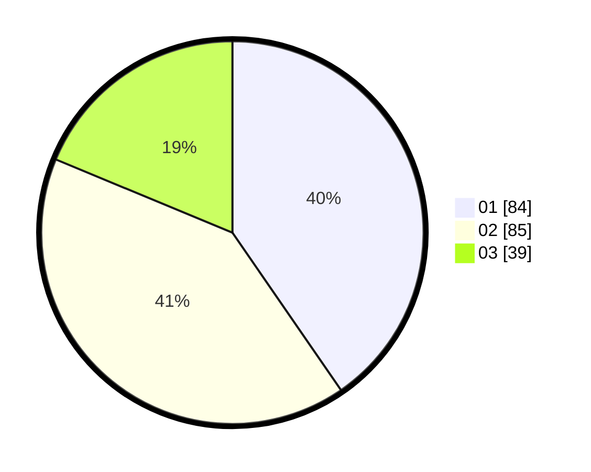

# Hasil

Hasil perolehan suara paslon dapat dilihat pada file paslon-01.txt, paslon-02.txt, dan paslon-03.txt.

Jika tidak ada, artinya data tersebut belum ada pada SIREKAP.

## Perolehan Suara

 * Paslon 01: **84**.
 * Paslon 02: **85**.
 * Paslon 03: **39**.

## Foto C Plano

https://sirekap-obj-formc.kpu.go.id/3db9/pemilu/ppwp/31/75/02/10/05/3175021005006-20240214-183757--7b2a41dd-5c36-40fc-92ce-d2bbc90e7fc0.jpg

https://sirekap-obj-formc.kpu.go.id/3db9/pemilu/ppwp/31/75/02/10/05/3175021005006-20240214-183759--883ceb15-1e27-4ebc-9750-aafba37eec98.jpg

https://sirekap-obj-formc.kpu.go.id/3db9/pemilu/ppwp/31/75/02/10/05/3175021005006-20240214-183758--e7b8715a-cb91-44c6-81ca-8cdc32f93038.jpg

## DATA PEMILIH TETAP

Jumlah pemilih dalam DPT: **206**.
 * L: **111**.
 * P: **95**.

## DATA PENGGUNA HAK PILIH

Jumlah pengguna hak pilih dalam DPT: **206**.
 * L: **111**.
 * P: **95**.

Jumlah pengguna hak pilih dalam DPTb: **3**.
 * L: **0**.
 * P: **3**.

Jumlah pengguna hak pilih dalam DPK: **2**.
 * L: **2**.
 * P: **0**.

Jumlah pengguna hak pilih: **211**.
 * L: **113**.
 * P: **98**.

## JUMLAH SUARA SAH DAN TIDAK SAH

JUMLAH SELURUH SUARA SAH: **208**.

JUMLAH SUARA TIDAK SAH: **3**.

JUMLAH SELURUH SUARA SAH DAN SUARA TIDAK SAH: **211**.
