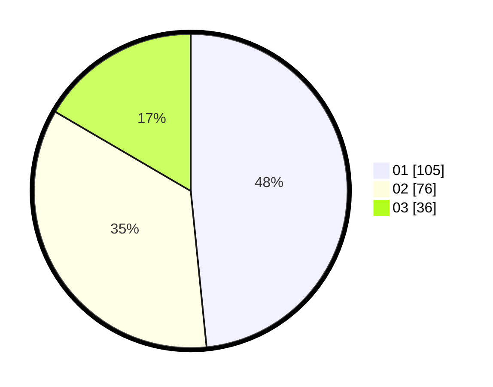

# Hasil

Hasil perolehan suara paslon dapat dilihat pada file paslon-01.txt, paslon-02.txt, dan paslon-03.txt.

Jika tidak ada, artinya data tersebut belum ada pada SIREKAP.

## Perolehan Suara

 * Paslon 01: **105**.
 * Paslon 02: **76**.
 * Paslon 03: **36**.

## Foto C Plano

https://sirekap-obj-formc.kpu.go.id/a679/pemilu/ppwp/31/75/02/10/05/3175021005007-20240214-155042--e3171404-2ce3-41af-8def-c59bb3df6c3a.jpg

https://sirekap-obj-formc.kpu.go.id/a679/pemilu/ppwp/31/75/02/10/05/3175021005007-20240214-155120--54e93576-63a4-46de-9c8b-50050e3d572e.jpg

https://sirekap-obj-formc.kpu.go.id/a679/pemilu/ppwp/31/75/02/10/05/3175021005007-20240214-155154--a55c02f6-8712-4f7e-bf4c-731596a05a7c.jpg

## DATA PEMILIH TETAP

Jumlah pemilih dalam DPT: **261**.
 * L: **126**.
 * P: **135**.

## DATA PENGGUNA HAK PILIH

Jumlah pengguna hak pilih dalam DPT: **203**.
 * L: **87**.
 * P: **115**.

Jumlah pengguna hak pilih dalam DPTb: **12**.
 * L: **0**.
 * P: **12**.

Jumlah pengguna hak pilih dalam DPK: **5**.
 * L: **2**.
 * P: **3**.

Jumlah pengguna hak pilih: **220**.
 * L: **89**.
 * P: **130**.

## JUMLAH SUARA SAH DAN TIDAK SAH

JUMLAH SELURUH SUARA SAH: **217**.

JUMLAH SUARA TIDAK SAH: **3**.

JUMLAH SELURUH SUARA SAH DAN SUARA TIDAK SAH: **220**.
