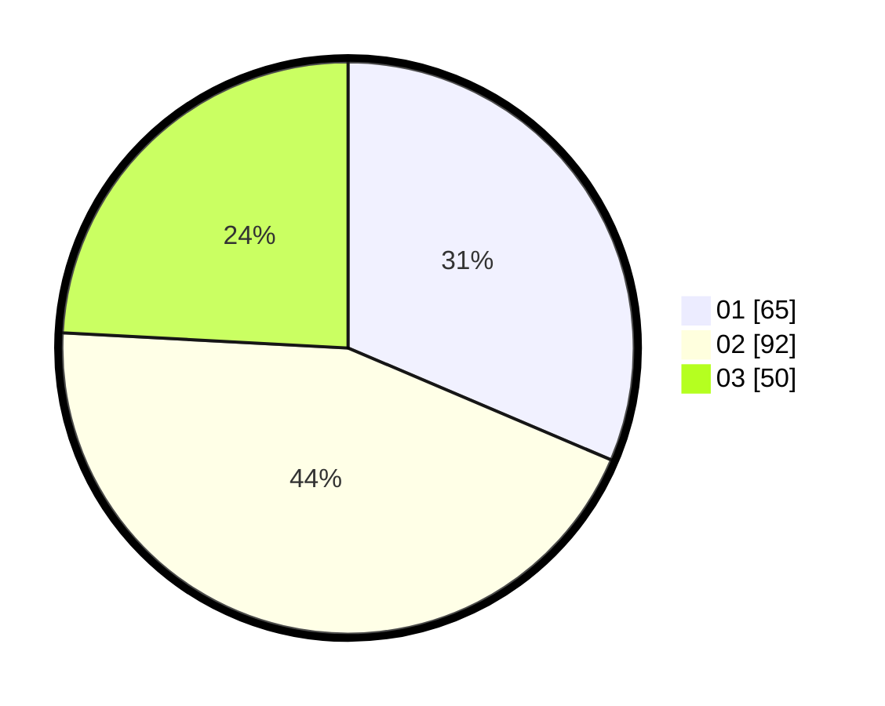

# Hasil

Hasil perolehan suara paslon dapat dilihat pada file paslon-01.txt, paslon-02.txt, dan paslon-03.txt.

Jika tidak ada, artinya data tersebut belum ada pada SIREKAP.

## Perolehan Suara

 * Paslon 01: **65**.
 * Paslon 02: **92**.
 * Paslon 03: **50**.

## Foto C Plano

https://sirekap-obj-formc.kpu.go.id/f3af/pemilu/ppwp/31/75/02/10/05/3175021005011-20240214-155842--2699f505-0d52-4c4b-b33d-3369e0f5f191.jpg

https://sirekap-obj-formc.kpu.go.id/f3af/pemilu/ppwp/31/75/02/10/05/3175021005011-20240214-155304--57f2fe42-4afb-44c8-af94-6cb56c53f3ac.jpg

https://sirekap-obj-formc.kpu.go.id/f3af/pemilu/ppwp/31/75/02/10/05/3175021005011-20240214-160124--122781ed-302e-4900-9266-64a34ab69a68.jpg
