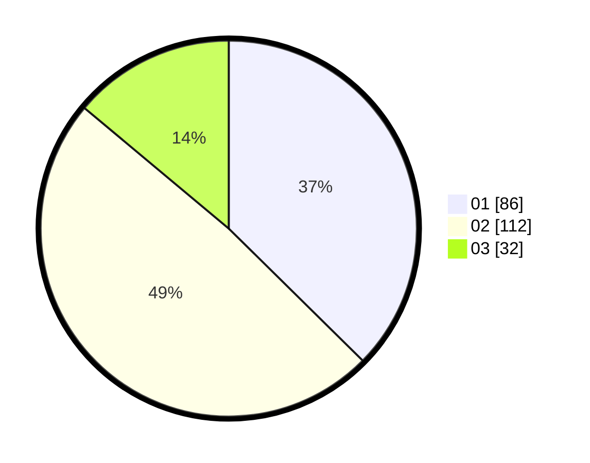

# Hasil

Hasil perolehan suara paslon dapat dilihat pada file paslon-01.txt, paslon-02.txt, dan paslon-03.txt.

Jika tidak ada, artinya data tersebut belum ada pada SIREKAP.

## Perolehan Suara

 * Paslon 01: **86**.
 * Paslon 02: **112**.
 * Paslon 03: **32**.

## Foto C Plano

https://sirekap-obj-formc.kpu.go.id/495c/pemilu/ppwp/31/75/02/10/05/3175021005024-20240216-062329--86487f65-6e9d-465e-b11f-a2903201d40d.jpg

https://sirekap-obj-formc.kpu.go.id/495c/pemilu/ppwp/31/75/02/10/05/3175021005024-20240216-062331--f37cb5b5-15f7-49b4-ae26-71d332f3ef2e.jpg

https://sirekap-obj-formc.kpu.go.id/495c/pemilu/ppwp/31/75/02/10/05/3175021005024-20240216-062330--182068c2-2717-47e9-be05-8caf037e7438.jpg

## DATA PEMILIH TETAP

Jumlah pemilih dalam DPT: **293**.
 * L: **146**.
 * P: **147**.

## DATA PENGGUNA HAK PILIH

Jumlah pengguna hak pilih dalam DPT: **231**.
 * L: **110**.
 * P: **121**.

Jumlah pengguna hak pilih dalam DPTb: **1**.
 * L: **1**.
 * P: **0**.

Jumlah pengguna hak pilih dalam DPK: **0**.
 * L: **0**.
 * P: **0**.

Jumlah pengguna hak pilih: **232**.
 * L: **111**.
 * P: **121**.

## JUMLAH SUARA SAH DAN TIDAK SAH

JUMLAH SELURUH SUARA SAH: **230**.

JUMLAH SUARA TIDAK SAH: **2**.

JUMLAH SELURUH SUARA SAH DAN SUARA TIDAK SAH: **232**.
