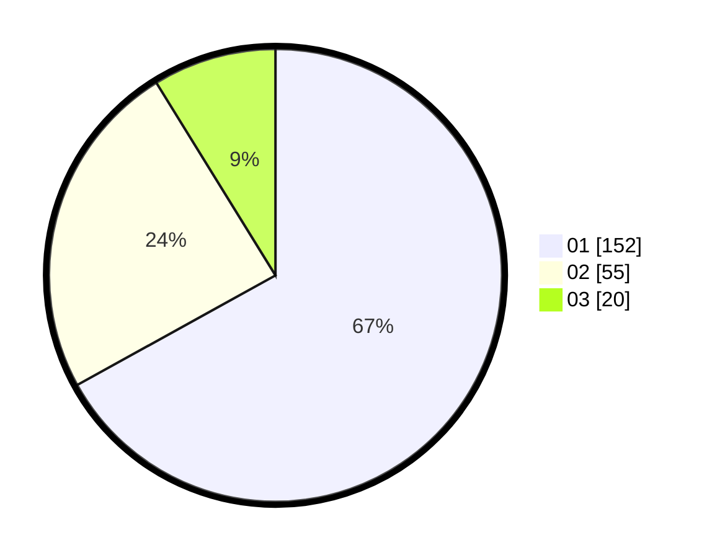

# Hasil

Hasil perolehan suara paslon dapat dilihat pada file paslon-01.txt, paslon-02.txt, dan paslon-03.txt.

Jika tidak ada, artinya data tersebut belum ada pada SIREKAP.

## Perolehan Suara

 * Paslon 01: **152**.
 * Paslon 02: **55**.
 * Paslon 03: **20**.

## Foto C Plano

https://sirekap-obj-formc.kpu.go.id/41ee/pemilu/ppwp/31/75/02/10/05/3175021005031-20240214-225951--38beb613-b0d2-4dd8-8162-6b1f4fb1c8c9.jpg

https://sirekap-obj-formc.kpu.go.id/41ee/pemilu/ppwp/31/75/02/10/05/3175021005031-20240214-230231--183e237e-2393-48fc-80f9-ba2bdb2a0f1a.jpg

https://sirekap-obj-formc.kpu.go.id/41ee/pemilu/ppwp/31/75/02/10/05/3175021005031-20240214-230316--de01db85-3d3e-43ec-bff8-341ebe72bb9b.jpg
