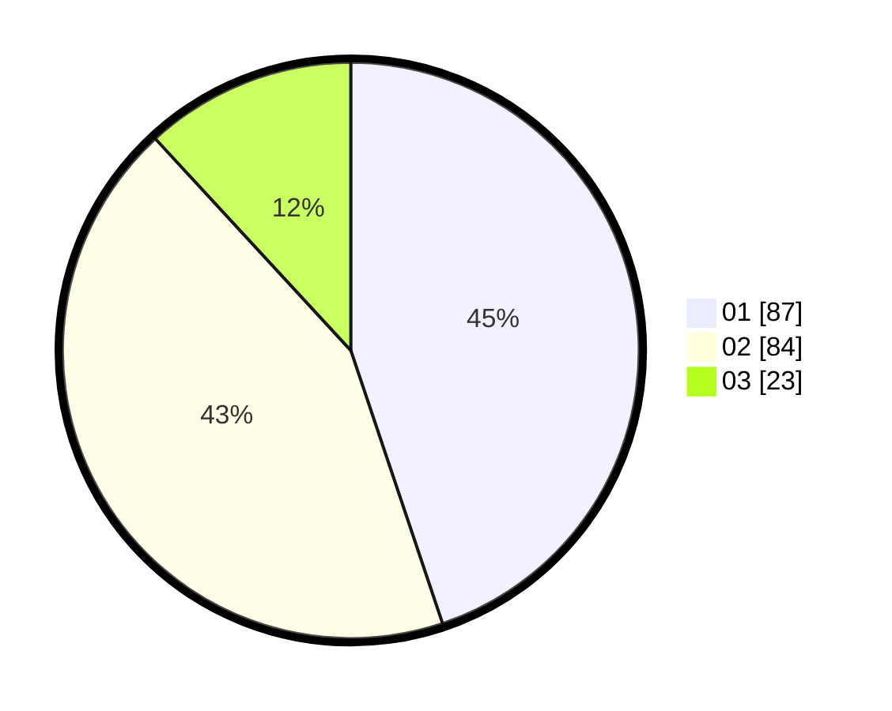

# Hasil

Hasil perolehan suara paslon dapat dilihat pada file paslon-01.txt, paslon-02.txt, dan paslon-03.txt.

Jika tidak ada, artinya data tersebut belum ada pada SIREKAP.

## Perolehan Suara

 * Paslon 01: **87**.
 * Paslon 02: **84**.
 * Paslon 03: **23**.

## Foto C Plano

https://sirekap-obj-formc.kpu.go.id/4a07/pemilu/ppwp/31/75/02/10/05/3175021005033-20240214-185811--0bf96950-3a1a-45b7-83e7-dae6dba00fbe.jpg

https://sirekap-obj-formc.kpu.go.id/4a07/pemilu/ppwp/31/75/02/10/05/3175021005033-20240214-202924--2da0c9ef-2557-45b0-ae5f-3edb6af731cb.jpg

https://sirekap-obj-formc.kpu.go.id/4a07/pemilu/ppwp/31/75/02/10/05/3175021005033-20240214-184857--dce9fea6-d32a-4657-8ce9-7476d6e1c8b0.jpg

## DATA PEMILIH TETAP

Jumlah pemilih dalam DPT: **265**.
 * L: **131**.
 * P: **134**.

## DATA PENGGUNA HAK PILIH

Jumlah pengguna hak pilih dalam DPT: **187**.
 * L: **84**.
 * P: **103**.

Jumlah pengguna hak pilih dalam DPTb: **4**.
 * L: **1**.
 * P: **3**.

Jumlah pengguna hak pilih dalam DPK: **4**.
 * L: **2**.
 * P: **2**.

Jumlah pengguna hak pilih: **195**.
 * L: **87**.
 * P: **108**.

## JUMLAH SUARA SAH DAN TIDAK SAH

JUMLAH SELURUH SUARA SAH: **194**.

JUMLAH SUARA TIDAK SAH: **1**.

JUMLAH SELURUH SUARA SAH DAN SUARA TIDAK SAH: **195**.
